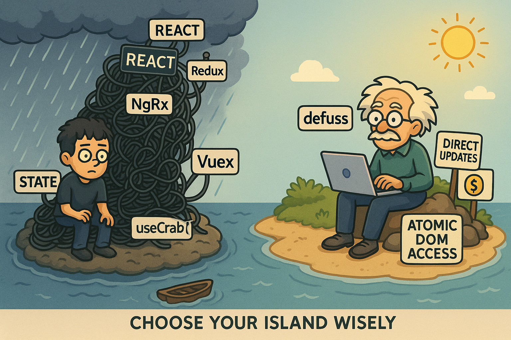

<h1 align="center">


<p align="center">
  <code>defuss</code>
</p>

<sup align="center">

Simplify & Succeed

</sup>

</h1>

> `defuss` is a simple, tiny and modern web framework. It puts and end to   **complexity**, promotes **explicit code**, and brings back the **joy** of building for the web! 😊

No time for long introductions? Here is the best way to learn `defuss`:

0. Get familiar with `defuss` [](https://stackblitz.com/github/kyr0/defuss/tree/main/examples/with-astro-ts?file=src%2Fcomponents%2FApp.tsx) *(~3min)*
1. **Play** with `defuss`' [./examples](examples/) *(~10min)*
2. [`create-defuss`](https://github.com/kyr0/defuss/tree/main/packages/create-defuss#-getting-started) **your own** `defuss` + `Astro` or `Vite` project  *(~20min)*
3. Read **The `defuss` Book** _(see below)_ && become a `defuss` expert *(~8h)*
4. Work through the **complete codebase** in [./packages](packages/) and become a **`defuss` core developer** *(~24h - 3d)*
5. Build your **dream product** and **succeed**! *(very soon)*

<p align="center">

  

</p>

<p align="center">
  <i><b>Come visit us on <code>defuss</code> Island!</b></i>
</p>

<h3 align="center">

How does `defuss` work?

</h3>

`defuss` is a tiny, modern web framework that is designed to be <u>extremly</u> simple and puristic. *Learn more about the motivation [here](https://github.com/kyr0/defuss?tab=readme-ov-file#the-defuss-story).*

- You are in full control: There is **no** implicit **reactivity**. 
- No hidden surprises: Every Component is rendered **once**.
- You work with the **native DOM**. 
- All APIs are **stable** and **classic**.
- Nevertheless, all **modern** web features are supported.

```tsx
// we need a few imports from the library (TypeScript-only)
import { type Props, type Ref, $, render } from "defuss"

// When using TypeScript, interfaces come in handy
// They help with good error messages!
export interface CounterProps extends Props {

  // what the button displays
  label: string;
}

// Component functions are called once! 
// No reactivity means *zero* complexity!
export function Counter({ label }: CounterProps) {

  // References the DOM element once it becomes visible.
  // When it's gone, the reference is gone. Easy? Yeah.
  const ref: Ref = {}

  // A vanilla JavaScript variable. No magic here!
  let clickCounter = 0

  // A native event handler. Called when the user clicks on the button.
  // Receives the native DOMs MouseEvent. No magic here either!
  const updateLabel = (evt: MouseEvent) => {

    // just increment the counter variable on click. Easy? Yeah.
    clickCounter++;

    console.log("updateLabel: Native mouse event", evt)

    // Changes the innerText of the <button> element.
    // You could also do: buttonRef.current.innerText = `...`
    // but dequery works like jQuery and is much simpler!
    $(ref).text(`Count is: ${clickCounter}`)
  }

  // Already when your code builds, this JSX is turned into a virtual DOM.
  // At runtime, the virtual DOM is rendered and displayed in the browser.
  // It usually is pre-rendered (SSR) on server-side and hydrated in the browser.
  return (
    <button type="button" ref={ref} onClick={updateLabel}>
      {/* This label is rendered *once*. It will never change reactively! */}
      {/* Only with *explicit* code, will the content of this <button> change. */}
      {label}
    </button>
  )
}

// whereever you place the Component markup, it is displayed...
render(<Counter label="Don’t. You. Dare. 👀" />, document.body)
```

<h3 align="center">

Using defuss in an existing `Astro` or `Vite` project

</h3>
If you'd like to integrate `defuss` in an existing `Astro` or `Vite` project, you need to install `defuss` manually:

```bash
# install a decent package manager
npm i -g pnpm@^9.13.2

# install the defuss library (in your projects root folder)
pnpm install defuss
```

- To install `defuss`' `Astro` integration manually, head over [here](packages/defuss-astro/README.md).

- To install `defuss`' `Vite` plugin manually, head over [here](packages/defuss-vite/README.md).


<h2 align="center">

The `defuss` Spirit

</h2>

- Trust the programmer.
- Don't prevent the programmer from doing what needs to be done.
- Keep it small and simple.
- Don't make the programmer repeat themselves.
- Make it work, make it fast, make it beautiful.


<h2 align="center">

The `defuss` Story

</h2>

<details>
<summary>
  <strong>👿 The Rant or: The Motivation for <code>defuss</code> </strong>
</summary>

Modern web engineering has spiraled into a maze of complexity. Endless layers of abstraction in today’s frameworks, ever-shifting APIs, and an explosion of dependencies have turned many codebases into hard to manage  beasts. The [cyclomatic complexity](https://en.wikipedia.org/wiki/Cyclomatic_complexity) is often hidden, as simple, public APIs are provided, but in-fact frightening when the programmer tries to understand  the implementation.

Because modern projects often depend on a myriad of third-party software components, systems and processes, they never fail to "amaze" with yet another breaking change or regression leading to bizarre bugs that are now part of our daily lives as programmers. 

Popular new patterns, paradigms and libraries, while valuable in the right context, are frequently added without nuance, creating problems they were meant to solve. Due to this phenomenon, most code written nowadays does not survive for more than four years. Compared to some Unix code being in production for centuries, one might ask: What's the price for mindless innovation? Even as a programmer you suddenly find yourself solving the same problems again and again in different flavours, or writing code to tame third-party software behaviour, to follow ideologic new paradigms, or optimize for misleading code quality metrics, instead of actually shipping features for your product.

It does not stop there. When searching the web for "best practices", you're faced with a gospel of pattern orthodoxy: "Loops are bad, use recursion!", "Mutation is the root of all evil, make everything immutable!", "No global state ever - fragment everything!", "Monoliths are bad - lets create 100 microservices for our 5 user app". The result? Mentally challanged programmers, bad code, inefficient software and a waste of money and natural resources. 

You might also encounter ideological extremes, such as rigid object-oriented dogma. Here, inheritance hierarchies stretch five levels deep, layered with many abstract classes, interfaces, and non-inheritable private methods. Such architecute may look organized, but is in fact very hard to customize and maintain.

On the flip side, some codebases adhere strictly to pure functional programming principles: `write(only(monads(because(everything(else(is(evil())))))))`
This approach also often relies on complex, recursive algorithms heavily and leads to code that is hard to read as well. It lacks imperative control flow and "done right", requires , constant memory mapping. 

The fact that most programmers just accept this situation as normal
these days, contributes to the problem. Choose software engineering as your career can lead to an increased prevalence to mental health issues these days. This is not an exaggeration, but backed by statistics. 

The toxic concept of a "10x enginner" writing "genius-level code" (or so they think), promoting solutions that are written in 20 lines of code and a fraction of time, instead of 200, is heavily misleading. Two months later, another programmer has to fix a bug in this and won’t be able to explain or defend this code as such code often relies on intrinsic cyclomatic complexity and is hard to explain or defend.

Elegant code doesn’t need to swear loyalty to any single paradigm, nor does it need to come in the shortest or most clever form. In fact, true elegance often arises from focusing on pragmatism and thoughtfully blending paradigms:

- Use **functional programming** for mathematical algorithms and data transformations, but name and encapsulate the concerns well. Use imperative control flow to wire/glue composed functional code.
- Rely on **object-oriented design** to define robust data types, and to allow programmers to implement API contracts, sharing an abstract implementation using thin layers of inheritance.
- Adopt **procedural programming** for linear workflows such as data processing pipelines.
- Opt for **recursion** in tree traversal, but stick to **loops** for simple list iterations.
- Use immutable data structures when serialization or journaling is a requirement, but don’t shy away from **in-memory mutation** when performance is more important.

The problem isn’t the tools, paradigms, frameworks and patterns themselves; it’s the blind use without understanding their implications. Complexity creeps in when we fail to assess whether a particular approach is the right fit or fail to oversee long-term effects.

The path to better software quality lies in questioning the *why* much more than the *what*. This is why documenting *why* a line of code is necessary is so effecting in literate programming: It makes you question if you even need this line of code. When in doubt, delete code. Every line not written is a line you or others don't need to maintain. Therefore, strip away unnecessary abstraction. When you’ve reduced your solution to its essence, so that nothing is left to remove, but it still solves the problem effectively, you've come to the most elegant solution that you could find. 

The philosophy I promote here is what I call **neo-pragmatic design**:

- **Neo**: Inspired by foundational principles of simplicity and clarity, championed by pioneers like Dennis Ritchie (co-creator of C and Unix).
- **Pragmatic**: Focused on delivering solutions that meet requirements without unnecessary overhead.
- **Design**: Prioritizing thoughtful, intentional decisions over hasty implementations, by remaining curious and always questioning the **why**.

This philosophy is not about rejecting modern frameworks, libraries, or paradigms in general. It’s about using them deliberately, understanding their trade-offs, and avoiding over-engineering. 

It’s about crafting elegant solutions tailored to the problem, not the latest trends. Last but not least, it's about mastering the craft of software engineering and truly understanding every line of the code you write, instead of playing the copy & paste game, previously involving Stack Overflow, and nowadays ChatGPT/LLMs, "just to make it work".

Dependencies deserve particular scrutiny. While external libraries can save time, they also bring risks: update fatigue, security vulnerabilities, bloat, and the potential to fail your entire project with a single core API change on their side. 

Often, the functionality you need amounts to just 5% of what a library provides. In such cases, writing your own solution is often simpler, faster, and more sustainable. However, it’s crucial to first read and understand the code of the library. While this might seem like a lot of unnecessary work, it’s actually curicial, as it can help you understand **why** and **how** things were implemented the way they are. It is an investment in your skills and your expertise.

Neo-pragmatic design emerged from my own hard-earned lessons. Painful experiences with overly complex codebases taught me the value of simplicity and elegance. I even had to go through mentally challenging times before I was able to get to an understanding that drove my motivation to create a library like `defuss` and write a book like this.

In the end, only *real programming* is *real fun*. Be or become a **real programmer**.
</details>

<details>
<summary><strong>🛠️ What is <code>defuss</code>?</strong></summary>

Enter `defuss`: a framework crafted to de-fuzz modern web development. This project was born from one deep belief: Web development doesn’t have to be this complex. It doesn’t have to steal your sanity.

It’s a tiny yet powerful foundation for building your next website, PWA,  enterprise web app or tauri/Electron app. `defuss` come as a vanilla, TypeScript/JavaScript framework with a tight integration to Vite and Astro. It offers tooling and an API that resembles the simplicity of the golden days of web development. 

`defuss` feels React-like but is truly just vanilla JavaScript/DOM API code, hence it also comes with a modern `jQuery`-like API that allows you to elegantly and atomically work with the DOM as well. 

In `defuss`, JSX is a first-class citizen at compile-time. `defuss` does  CSR, SSR with hydration and supports all modern features you might expect, but it implements them in the most simple and straight-forward way. 

It doesn't come with complicated reactive state management. It does not limit your freedom as a programmer in any way: Feel free to do stupid things, and also to hack around and break stuff: All JavaScript runtime, Browser runtime and DOM operations are supported at all time.

Thus, `defuss` embodies the original hacker philosophy — challenging you to keep learning, keep sharpening your skills, and continually evolve as a sharper thinker, a more thoughtful engineer, and an inspiring tinkerer.

Because `defuss` is tiny and simple, it’s also a highly customizable  framework. Need a custom core feature? Why don't you simply *fork* and *adapt* it? Just send me a PR and I'll see if it makes it in! 

p.s.: Try this with React or Solid.js - good luck!! ;)
</details>

<details>
<summary><strong>📓 The <code>defuss</code> Manifesto</strong></summary>

The best code is elegant code. But that is that? It's solving a small problem or composing solutions to solve a bigger problem, but **simple** and in the most **straight-forward** way possible. Elegant code strikes a balance between being readable and efficient. It does only what truly  *needs* to be done. Elegant code that comes with a documentation that answers also explains *why* it had to be done **exactly this way**. 

Hence, code that is *elegant* has been written to solve a specific problem, mindful of computing resources (facilitating green computing), and aware of a future programmer reading and maintaining the code. 

Code, born not from lazy *copy & paste* rituals without actual understanding, but from deliberate, thoughtful design. We start by questioning the requirements, narrowing the scope, before we craft an algorithm. We simplify, test, refine, test, and simplify again — until there is nothing left to take away before it breaks. This leads to excellent software quality. This is real software craftsmanship.

With a deep understanding of technology and a commitment to excellent, simple and elegant solutions, it becomes possible to create amazing products with a fraction of the usual time spent on implementation, money wasted on unnecessary computing resources and effort spent on maintining overcomplex codebases.

Because what’s the only code that cannot malfunction? The only code that costs nothing? The code that doesn’t need to be fixed? Right — the code that has never been written in the first place!
</details>

<details>
<summary><strong>🤔 Should I give <code>defuss</code> a try? </strong></summary>


It will only take you a few minutes, and you might learn something new! So, _**why not give it a try?**_

I hope you’ll enjoy building your next project with **defuss**! Start small with a spare-time project before diving head-first into an enterprise-level project built on defuss.

For state synchonization you might write a few extra lines of code since defuss intentionally lacks reactivity. But in return, you’ll always know exactly **what’s happening, where it’s happening, and why it’s happening.**

Many frameworks and libraries that depend on a specific frontend framework won't work with defuss, but every vanilla JavaScript library ever written, will. That’s by design! In the philosophy of `defuss`, this is a feature, not a bug. Read the code of your favorite library or framework, learn how it works, and rebuild what you need. Chances are it's just a few lines of <code>defuss</code> code. You’ll enjoy the process, craft exactly what you need, gain mastery over your own code, and eventually will end up being an even smarter software engineer than before.

Worried about **stability**? No worries! The core API is **tiny**, just a few functions, and they are kept stable until after the W3C will decide that the DOM is obsolete. There’s also not much that can go wrong with `defuss`, simply because there’s not much *code* in `defuss` to begin with. `defuss` is a thin, but opinionated layer of abstraction. If something breaks, it’s so tiny, simple, and well-documented that you can fix it yourself — or even with the help of AI, if you’re still learning coding.

- Professor Defuss

</details>

<h2 align="center">Meet Professor Defuss!</h2>

<table>
  <tr>
  <td width="100px">
    
    <center><b>Professor Defuss</b></center>
  </td>
  <td>

  Hello, hello, I'm Professor Defuss! *Hmm-ya, yes, yes*, I can be a bit *fussy* at times, but don't sratch your head! I'll teach you how defuss actually works - aaand to write simple, elegant code... *errm* - *defuss'ed* code! Because, as my dear uncle Einstein used to say: "Everything should be made as simple as possible, but not simpler!"

  </td>
  </tr>
</table>

---
---

<h2 align="center">

The `defuss` Book

</h2>

<h3 align="center">

_- Work in progress -_

</h3>

---


### Table of Contents (ToC)

#### 0. Introduction

#### 1. WebTech Masterclass

##### 1.1 The Lifecycle of modern WebApps
##### 1.2 The DOM API: HTML and CSS decomposed
##### 1.3 A modern, vanilla JavaScript WebApp
##### 1.4 The point of transpilation and bundling
##### 1.5 CSS: Component vs. utility classes
##### 1.6 The promises of abstraction and reactivity
##### 1.7 Ideology vs. Pragmatism: OOP edition
##### 1.8 Ideology vs. Pragmatism: FP edition
##### 1.9 Sweet-spot: Thin layers of abstraction
##### 1.10 Sweet-spot: Simple, explicit code

#### 2. The `defuss` Way

##### 2.1 Why JSX?
##### 2.2 JSX in `defuss`: The `defuss/renderer`
##### 2.3 `jQuery`'s API was a great idea!
##### 2.4 `defuss/dequery`: A new take on `jQuery`
##### 2.5 Tiny CSS utilities: `defuss/dewind`
##### 2.6 Vite-support: The `defuss-vite` plugin
##### 2.7 Writing an Astro Integration: `defuss-astro`
##### 2.8 Setup from scratch: `defuss` + `Astro`
##### 2.9 Setup from scratch: `defuss` + `Vite`
##### 2.10 Becoming a core developer of `defuss`

#### 3. Let's play `defuss`!

##### 3.1 A simple "Hello, Professor Defuss!" with Vite
##### 3.2 Your `defuss` portfolio website with Astro
##### 3.3 PWA: Your portfolio becomes a digital VCard
##### 3.4 Need for Speed: Service Workers edition
##### 3.5 `defuss` Music: A synthesizer with Audio Worklets 
##### 3.6 Building `defuss/devtools` as a browser extension
##### 3.7 DOOM runs on `defuss`! Integrating WebAssembly modules
##### 3.8 TauriSweeper: A MineSweeper-clone built with `Tauri` + `defuss`

### 0. Introduction

`defuss` is a web framework. It's meant to support you writing elegant, tailor-made code for your next WebApp. This might be a portfolio website, a blog, an enterprise business web app, a portable mobile web application (PWA), or a desktop app that you build with web technologies (Tauri, Electron). While `defuss` primarily focuses on frontend (browser) technologies right now, tiny abstraction libraries for common backend tasks are in-scope too.

TODO!

---


<caption><i><b>Come visit us on defuss island!</b></i></caption>