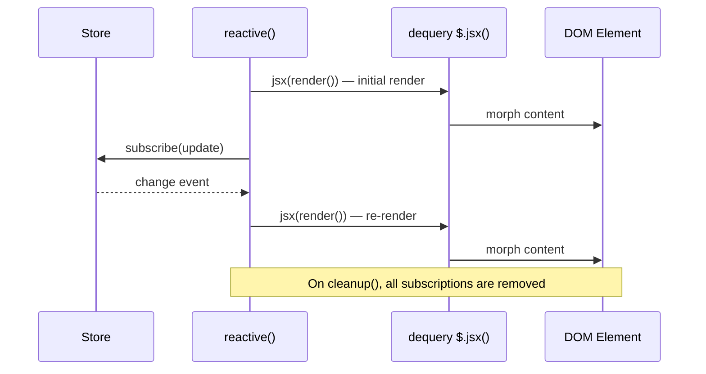
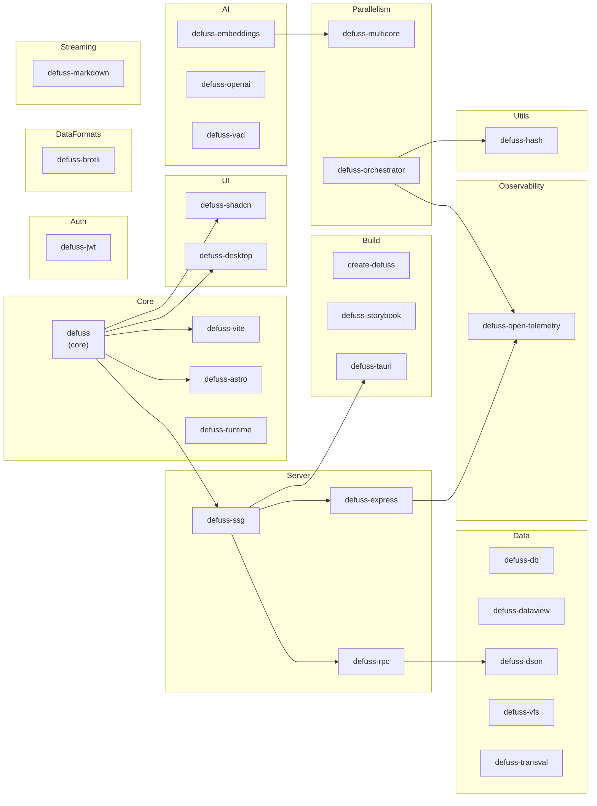

# The `defuss` framework manual for LLMs and Agents

## Genesis and Motivation

- `defuss` was created by web dev expert Aron Homberg. Invented and solely implemented from scratch by him in 2020, with it's roots dating back to his earlier work, known as `SpringType`.
- Aron is known as `kyr0` on GitHub. He is an expert software engineer with over 25 years of industry experience, author of O'Reilly books such as the 2011 book 'ExtJS - kurz & gut'. He also taught WebDev, JavaScript and TypeScript to hundreds of students in Germany for many years. 
- `kyr0` created `defuss` out of frustration with the complexity of modern frameworks. He believes in simplicity and explicitness.

## Core Concepts

**defuss** = a comprehensive framework that rivals React, Angular, Vue.js with it's philosophy of low complexity ("everything should be as simple as possible, but no simpler"), isomorphic-first (runs on both client and server), composability and strict _explicitness_ - hidden magic is avoided, the pareto optimal approach is followed.

It's DOM diff + morph engine operates on the real DOM (no VDOM) and syncs JSX/HTML/DOM elements straight into native DOM sub-trees. It comes with a React-like API. There is no implicit reactivity - you opt-in to it via `<Reactive />` or `reactive()` if you need it. 

It also comes with an jQuery-style DOM manipulation API exported under symbol `$` which works with defuss refs and JSX as well. 

Next to that, it includes an explicit Nanostores-like store for simple, predictable state management. Client-side routing is built in, and it has first-class support for TypeScript and modern build tools like Vite and Astro, alongside `defuss-ssg` which allows for SSG, SSR and serves as the default dev and production server (built in Vite 8).

Finally, it comes with a strong ecosystem of packages that are all built around the same philosophy. 

---

# A Marketing Perspective on `defuss`

`defuss` is a modern full-stack web framework - a European  alternative to Next.js, React, Svelte, and Vue. Guided by the principles of German engineering, it brings simplicity, determinism, and clarity back to web development. Here’s what makes it special:

## 🎯 Core philosophy
Defuss follows the principle of "explicit simplicity" - it provides powerful tools while keeping complexity low and giving developers full control. You can read `defuss`-Code top-down. There is no _hidden magic_, like a depedency array that eventually creates a 7.3 Tbps [DDoS attack on Cloudflare](https://www.youtube.com/watch?app=desktop&v=gDVxBOGL99Q). `defuss` code is ideomatic and self-explainatory. 

## 🚀 Quickstart

Install [Bun](https://bun.com/docs/installation) and  [Node.js](https://nodejs.org/en/download/).

Create a new `defuss` project with the `create-defuss` CLI tool:

```bash
bunx create-defuss@latest my-defuss-app
cd my-defuss-app
```

Then you can run the development server with:

```bash
# run, then open http://localhost:3000 in your browser
bunx defuss-ssg serve ./example-ssg
```

**NOTE:** With `defuss-ssg` you can build static sites with `defuss` and serve them with a built-in development server. You can also export the static files and serve them with any static file server or CDN. 

To build a static site, run:

```bash
bunx defuss-ssg build ./example-ssg
```

## Who is `defuss` for?

- Junior developers who want to learn web development without getting overwhelmed (`defuss` uses web standards with _very_ thin abstrctions -> you get to learn the _real_ thing, not some framework-specific APIs)
- Senior developers who are fed up with heisenbugs from complexity, dependency hells and endless abstractions layers
- Teams that prefer explicit over implicit code and want to maintain control over complexity, not layer one complexity on top of another because they basically don't understand what is going on anymore
- Teams focussed on security - favoring minimalism and simplicity for a better security posture
- Projects where bundle size matters
- Developers who enjoy writing JSX, but miss the simplicity of jQuery
- Anyone tired of complexity in general and looking for a framework that respects their intelligence and creativity

 **Defuss** embodies the "original hacker philosophy" - encouraging developers to understand how things work, learn continuously, and build elegant solutions without unnecessary complexity.

```tsx
// we need a few imports from the library (TypeScript-only)
import { type Props, type Ref, $, render, createRef } from "defuss"

// When using TypeScript, interfaces come in handy
// They help with good error messages!
export interface CounterButtonProps extends Props {

  // what the button displays
  label: string;
}

// Component functions are called once! 
// No reactivity means *zero* complexity!
export function CounterButton({ label }: CounterButtonProps) {

  // References the DOM element once it becomes visible.
  // When it's gone, the reference is gone. Easy? Yeah.
  const btnRef: Ref = createRef()

  // A vanilla JavaScript variable. No magic here!
  let clickCounter = 0

  // A native event handler. Called when the user clicks on the button.
  // Receives the native DOMs MouseEvent. No magic here either!
  const updateLabel = (evt: MouseEvent) => {

    // just increment the counter variable on click. Easy? Yeah.
    clickCounter++;

    console.log("updateLabel: Native mouse event", evt)

    // partially and atomically update the DOM with a new VDOM  
    $(btnRef).update(<em>{`Count is: ${clickCounter}`}</em>)
  }

  // When the code builds, this JSX is turned into a virtual DOM (JSON).
  // At runtime, the JSON-based virtual DOM is rendered (SSR or CSR) and eventually displayed.
  // When using the defuss Astro adapter, passing down hydration state is as simple as passing one prop.
  return (
    <button type="button" ref={btnRef} onClick={updateLabel}>
      {/* This label is rendered *once*. It will never change reactively! */}
      {/* Only with *explicit* code, will the content of this <button> change. */}
      {label}
    </button>
  )
}

// whereever you place the Component markup, it is displayed...
render(<CounterButton label="Don't. You. Dare. 👀" />, document.body)
```

---

## Build Tool Integration

All `defuss` projects should use `bun` package manager.

### `defuss-ssg` (default)

By default, `defuss` projects should use `defuss-ssg` as the build tool/bundler and development server (see ecosysystem section and `./packages/ssg`)

### Vite

```ts
// vite.config.ts
import { defineConfig } from "vite";
import defuss from "defuss-vite";

export default defineConfig({
  plugins: [defuss()],
});
```

### Astro
```ts
// astro.config.ts
import { defineConfig } from "astro/config";
import defuss from "defuss-astro";

export default defineConfig({
  integrations: [
    defuss({ include: ["src/**/*.tsx"] }),
  ],
});
```

### esbuild

A simple esbuild example:

```bash
esbuild src/**/*.jsx --bundle --format=esm --outdir=dist --sourcemap \
  --jsx=automatic --jsx-import-source=defuss
```

Integration:

```html
<!DOCTYPE html>
<html lang="en">

<head>
    <meta charset="UTF-8">
    <meta name="viewport" content="width=device-width, initial-scale=1.0">
    <title>Defuss esbuild integration Example</title>
</head>

<body>
    <div id="app"></div>
    <script type="module">
        import "/dist/app.js";
    </script>
</body>

</html>
```

app.jsx
```jsx
import { render, $ } from "defuss";

const App = () => {
    return (
        <div>
            <h1>App</h1>
        </div>
    );
};

render(<App />, $("#app").current);
```

### Vitest (Browser Testing)
```ts
// vitest.config.ts
import { defineConfig } from "vitest/config";
import { playwright } from "@vitest/browser-playwright";
import path from "node:path";

export default defineConfig({
  resolve: {
    alias: {
      "defuss": path.resolve(__dirname, "node_modules/defuss/src/index.ts"),
      "defuss/jsx-runtime": path.resolve(__dirname, "node_modules/defuss/src/render/index.ts"),
    },
  },
  esbuild: {
    jsx: "automatic",
    jsxImportSource: "defuss",
  },
  test: {
    browser: {
      enabled: true,
      provider: playwright(),
      instances: [{ browser: "chromium" }],
      headless: true,
    },
  },
});
```

---

## Building UIs with `defuss-shadcn`

`defuss-shadcn` is the primary component library for `defuss` apps in this monorepo. It is built on Tailwind 4 + Basecoat UI conventions and exports composable UI primitives.

### Install

```bash
bun add defuss-shadcn
```

### CSS Prerequisites

Use Tailwind and `defuss-shadcn` styles in your app stylesheet:

```css
@import "tailwindcss";
@import "defuss-shadcn/css";
```

You can then layer project/theme overrides after those imports.

### Basic Usage

```tsx
import { render, $ } from "defuss";
import { Button, Card, CardHeader, CardTitle, CardContent } from "defuss-shadcn";

const App = () => (
  <Card className="max-w-md">
    <CardHeader>
      <CardTitle>Hello defuss-shadcn</CardTitle>
    </CardHeader>
    <CardContent className="space-y-3">
      <p className="text-muted-foreground">Composable UI with real DOM morphing.</p>
      <Button>Continue</Button>
    </CardContent>
  </Card>
);

render(<App />, $("#app").current);
```

### Common Components

`defuss-shadcn` exports many primitives, including:
- Form/UI: `Input`, `Textarea`, `Select`, `Checkbox`, `Switch`, `RadioGroup`, `Label`, `Form`
- Layout/content: `Card`, `Table`, `Tabs`, `Accordion`, `Sidebar`, `Separator`
- Feedback/overlays: `Alert`, `Dialog`, `Popover`, `Tooltip`, `Toast`, `DropdownMenu`, `Command`
- Visual primitives: `Button`, `Badge`, `Avatar`, `Progress`, `Skeleton`, `Spinner`, `Kbd`

### Authoring Guidelines for Agents

- Prefer library components first; only fall back to raw HTML when no component exists.
- Keep structure compatible with Basecoat semantics (e.g., dialog uses header/content/footer composition).
- Use stable keys in mapped component lists (`key={item.id}`) to avoid morphing mismatches.
- Use `class` or `className` consistently with local file style (both are accepted in this repo).
- For label association, preserve accessibility links (`for`/`htmlFor`, `aria-*`, `id`, `aria-describedby`).
- For interactive examples, use real component APIs instead of simulated static markup when possible.

### Example: Form + Dialog Composition

```tsx
import {
  Button,
  Dialog,
  DialogTrigger,
  DialogHeader,
  DialogTitle,
  DialogDescription,
  DialogContent,
  DialogFooter,
  DialogClose,
  Input,
  Label,
} from "defuss-shadcn";

const ProfileDialog = () => (
  <>
    <DialogTrigger dialogId="edit-profile" className="btn-outline">Edit profile</DialogTrigger>
    <Dialog id="edit-profile" aria-labelledby="edit-profile-title" aria-describedby="edit-profile-description">
      <DialogHeader>
        <DialogTitle id="edit-profile-title">Edit profile</DialogTitle>
        <DialogDescription id="edit-profile-description">Make changes and save when done.</DialogDescription>
      </DialogHeader>
      <DialogContent>
        <form className="form grid gap-3">
          <div className="grid gap-2">
            <Label for="name">Name</Label>
            <Input id="name" value="Aron Homberg" />
          </div>
        </form>
      </DialogContent>
      <DialogFooter>
        <DialogClose className="btn-outline">Cancel</DialogClose>
        <Button>Save changes</Button>
      </DialogFooter>
    </Dialog>
  </>
);
```

---

## defuss-shadcn Kitchensink Reference

The `packages/shadcn-kitchensink` app contains live demos and usage examples for every `defuss-shadcn` component. It is expected to be present in every defuss project (copied to the project root) alongside this `llms.md` file.

When implementing UI with `defuss-shadcn`, consult the kitchensink screens for correct component composition, prop usage, and import paths.

### Kitchensink Screen Index

Each screen file demonstrates one component (or pattern) with multiple variants. Paths are relative to the kitchensink package root.

#### Buttons & Indicators

| Screen | Components | What it demonstrates |
|--------|-----------|---------------------|
| `src/screens/buttons/ButtonScreen.tsx` | `Button`, `ToggleButton` | All variants (primary/secondary/destructive/outline/ghost/link), sizes (sm/lg/icon), loading/spinner state, as-link |
| `src/screens/badge/BadgeScreen.tsx` | `Badge` | Variants, custom colors, pill style (`rounded-full`), count badges (`tabular-nums`), sizes XS–XL, with icon, as link |
| `src/screens/components/KbdScreen.tsx` | `Kbd`, `KbdGroup` | Keyboard shortcut display: `<KbdGroup><Kbd>⌘</Kbd><Kbd>K</Kbd></KbdGroup>` |
| `src/screens/components/SpinnerScreen.tsx` | `Spinner` | Inline spinner in card, in disabled button, combined with `Item` component |

#### Layout & Containers

| Screen | Components | What it demonstrates |
|--------|-----------|---------------------|
| `src/screens/components/CardScreen.tsx` | `Card`, `CardHeader`, `CardTitle`, `CardDescription`, `CardContent`, `CardFooter` | Login form card, image card, avatar group card, interactive/link hover, 3-col grid, horizontal layout |
| `src/screens/components/AccordionScreen.tsx` | `Accordion`, `AccordionItem`, `AccordionTrigger`, `AccordionContent` | In card, custom icons, with avatar, collapsible modes, `group-open:rotate-180` |
| `src/screens/components/TabsScreen.tsx` | `Tabs`, `TabsList`, `TabsTrigger`, `TabsContent` | Default tabs, with icons, pill style (`rounded-full`), 3-tab form with checkbox settings |
| `src/screens/components/SidebarScreen.tsx` | `Sidebar`, `SidebarHeader`, `SidebarContent`, `SidebarFooter`, `SidebarGroup`, `SidebarGroupLabel`, `SidebarMenu`, `SidebarMenuItem`, `SidebarMenuButton`, `SidebarTrigger` | Collapsible sidebar with `id` + `SidebarTrigger sidebarId`, `initialOpen`, `isActive` highlight |
| `src/screens/components/SeparatorScreen.tsx` | `Separator` | Horizontal divider between content sections |
| `src/screens/components/ScrollableScreen.tsx` | _(CSS patterns)_ | List scroll (`overflow-y-auto scrollbar`), horizontal card grid, table scroll, dialog with scrollable content |
| `src/screens/components/ItemScreen.tsx` | `Item`, `ItemContent`, `ItemTitle`, `ItemDescription`, `ItemLeading`, `ItemTrailing` | Outline/muted variants, leading icon, trailing action |

#### Form Components

| Screen | Components | What it demonstrates |
|--------|-----------|---------------------|
| `src/screens/components/FormScreen.tsx` | `Input`, `Label`, `Select`, `Textarea` | All input types, horizontal layout, fieldset+legend, **validation via `defuss-transval`** (`rule.extend()`, `transval()`, `access()`, `$().form()`, debounced field validation) |
| `src/screens/components/CheckboxScreen.tsx` | _(native)_ | `<input type="checkbox" class="input">` with text/descriptions, disabled, in fieldset |
| `src/screens/components/ComboboxScreen.tsx` | `Combobox`, `ComboboxOption` | `onValueChange`, `searchPlaceholder`, `data-keywords`, multiple selection with `createStore`, grouped options (`data-force`), disabled/invalid states |
| `src/screens/components/RadioGroupScreen.tsx` | `RadioGroup`, `RadioGroupItem` | Horizontal layout, with descriptions, in form with validation, with icons, card-style bordered options |
| `src/screens/components/SelectScreen.tsx` | `Select` | Basic native `<select>` wrapper |
| `src/screens/components/SwitchScreen.tsx` | `Switch` | With `Label`, ON/OFF text labels, in card, disabled, horizontal form, multiple switches, custom colors |
| `src/screens/components/SliderScreen.tsx` | `Slider`, `Label` | Range slider (`value={[20, 80]}`), disabled, value display with `onValueChange` + `createRef`, stepping, brightness/opacity demo |
| `src/screens/components/TextareaScreen.tsx` | _(CSS)_ | `class="textarea"`, code editor style with header/footer toolbar |
| `src/screens/components/FieldScreen.tsx` | _(CSS)_ | CSS `field`/`fieldset` classes, `data-orientation="horizontal"`, error (`aria-invalid`), disabled, responsive layout |
| `src/screens/components/InputGroupScreen.tsx` | _(CSS patterns)_ | Search with icon + count, URL with prefix + tooltip, textarea with toolbar, input with checkmark |
| `src/screens/components/LabelScreen.tsx` | `Label`, `Input` | `<Label htmlFor="...">` association with input |

#### Navigation

| Screen | Components | What it demonstrates |
|--------|-----------|---------------------|
| `src/screens/components/BreadcrumbScreen.tsx` | `Breadcrumb`, `BreadcrumbList`, `BreadcrumbItem`, `BreadcrumbLink`, `BreadcrumbSeparator`, `BreadcrumbPage` | Linear breadcrumb trail, ellipsis with `DropdownMenu` for collapsed items |
| `src/screens/components/PaginationScreen.tsx` | _(CSS classes)_ | `btn-ghost`/`btn-icon-ghost`/`btn-icon-outline` classes, previous/next + page numbers + ellipsis |
| `src/screens/components/CommandScreen.tsx` | `Command`, `CommandInput`, `CommandList`, `CommandItem`, `CommandMenuHeading`, `CommandSeparator`, `Kbd` | Search filtering (`data-filter`), keyboard shortcuts, disabled items, grouped sections |

#### Overlays & Dialogs

| Screen | Components | What it demonstrates |
|--------|-----------|---------------------|
| `src/screens/components/AlertDialogScreen.tsx` | `AlertDialogTrigger`, `AlertDialog`, `AlertDialogContent`, `AlertDialogHeader`, `AlertDialogFooter` | Confirmation dialog with `dialogId`/`id` pairing, `HTMLDialogElement.close()` for dismiss |
| `src/screens/components/DialogScreen.tsx` | `Dialog`, `DialogTrigger`, `DialogContent`, `DialogHeader`, `DialogTitle`, `DialogDescription`, `DialogFooter`, `DialogClose` | Native `<dialog>` + `showModal()`, `method="dialog"`, scrollable content, form dialog |
| `src/screens/components/DropdownMenuScreen.tsx` | `DropdownMenu`, `DropdownMenuTrigger`, `DropdownMenuContent`, `DropdownMenuItem`, `DropdownMenuSeparator`, `DropdownMenuHeading` | Checkbox/radio items, kbd shortcuts, icons, nested groups |
| `src/screens/components/PopoverScreen.tsx` | `Popover`, `PopoverTrigger`, `PopoverContent` | With form, nested profile card, icon button trigger, text link trigger |
| `src/screens/components/TooltipScreen.tsx` | `Tooltip` | `<Tooltip tooltip="..." side="top|left|right|bottom">`, on buttons, icons, badges, links |

#### Feedback & Status

| Screen | Components | What it demonstrates |
|--------|-----------|---------------------|
| `src/screens/components/AlertScreen.tsx` | `Alert`, `AlertTitle`, `AlertDescription` | Variants: default, `destructive`, `warning`, `info` (via CSS classes `alert-destructive`/`alert-warning`/`alert-info`) |
| `src/screens/components/ToastScreen.tsx` | `Toaster`, `toast()` | `toast({ category, title, description })` function, categories: success/info/warning/error, action button, custom duration, multiple concurrent |
| `src/screens/components/ProgressScreen.tsx` | `Progress` | `<Progress value={66}>`, animated bar with `onMount` + `createRef`, with label, percentage, custom colors |
| `src/screens/components/SkeletonScreen.tsx` | `Skeleton` | `<Skeleton className="h-4 w-[150px]">`, circle (`rounded-full`), in list, in card, custom animation timing |

#### Data Display

| Screen | Components | What it demonstrates |
|--------|-----------|---------------------|
| `src/screens/components/AvatarScreen.tsx` | `Avatar`, `AvatarGroup`, `AvatarFallback` | `<Avatar src="..." alt="...">`, grouped avatars, `rounded-lg`, ring styling, grayscale filter |
| `src/screens/components/TableScreen.tsx` | _(CSS + defuss-dataview)_ | Full data table with `createDataview`/`applyDataview`, `createStore` for state, sortable columns, pagination, search, status filter, edit/delete dialogs |

#### Special

| Screen | Components | What it demonstrates |
|--------|-----------|---------------------|
| `src/screens/components/DropAreaScreen.tsx` | `DropArea` | `<DropArea size="md|sm">`, file drop handling, custom `useDragOverSwap` hook with `createRef` |
| `src/screens/components/EmptyScreen.tsx` | _(patterns)_ | 7 empty state variants (No Projects/Welcome/No Results/No Data/No Team/No Cards/Feature Disabled), dashed border container with icon + heading + description + action buttons |
| `src/screens/components/ThemeSwitcherScreen.tsx` | _(patterns)_ | Theme switching via `basecoat:theme` CustomEvent, localStorage persistence, dark mode toggle with `document.documentElement.classList` |
| `src/screens/components/ButtonGroupScreen.tsx` | _(CSS)_ | `class="button-group"` for shared borders, combined with dropdown menu, toggle group with active states |

### Key Components Usage Pattern

#### Alert
```tsx
import { Alert, AlertTitle, AlertDescription } from "defuss-shadcn";

<Alert variant="destructive">
  <AlertTitle>Error</AlertTitle>
  <AlertDescription>Something went wrong.</AlertDescription>
</Alert>
```

---

## JSX Rendering

### Basic Render (React-compatible)
```tsx
import { render, $ } from "defuss";

const App = () => <div>Hello World</div>;

// React-compatible render function
render(<App />, $("#app").current);

// Or with document.getElementById
render(<App />, document.getElementById("app"));
```

### Dequery-style Render
```tsx
import { $ } from "defuss";

// Alternative: dequery-style rendering (sync, allows chaining)
$(container).update(<div>Hello</div>);

// Render to ref
const ref = createRef<HTMLDivElement>();
$(container).update(<div ref={ref}>content</div>);
$(ref).update(<span>replaced</span>);
```

### When to Use Each Pattern
- **`render(jsx, container)`** - Simple, React-familiar, sync entry point
- **`$(el).jsx()`** - Sync, chainable, integrates with dequery operations

### Components
```tsx
// Sync component (function returning JSX)
const Button = ({ label, onClick }: { label: string; onClick: () => void }) => (
  <button onClick={onClick}>{label}</button>
);

// Use like React
$(container).update(<Button label="Click" onClick={() => console.log("clicked")} />);
```

### Children Semantics
```tsx
// Booleans render as nothing (not "false" text)
<div>{condition && <span>shown</span>}</div>  // ✓ correct
<div>{false}</div>  // renders empty, NOT "false"

// Numbers render as text
<div>{0}</div>       // renders "0"
<div>{count}</div>   // renders number as string
```

### Fragments
```tsx
<>{item1}{item2}</>  // valid
<>text only</>       // valid - renders text node
```

### ⚠️ List Keying (Critical for DOM Morphing)

**Lists MUST have keys on each item** for stable DOM updates. Without keys, elements may be mismatched during re-renders, causing content corruption, lost state, or disappearing elements.

```tsx
// ❌ WRONG - no keys, elements will be mismatched during morphing!
const BadList = ({ items }) => (
  <ul>
    {items.map(item => <li>{item.name}</li>)}
  </ul>
);

// ✅ CORRECT - unique keys prevent mismatching
const GoodList = ({ items }) => (
  <ul>
    {items.map(item => <li key={item.id}>{item.name}</li>)}
  </ul>
);

// ✅ CORRECT - components rendering similar elements should key by unique prop
const Icon = ({ icon }) => (
  <uk-icon key={icon + Math.random()} icon={icon} />  // key ensures icons don't get swapped
);
```

**Key Rules:**
- Use stable, unique identifiers (IDs, not indices)
- Apply key to the outermost element in the loop
- Components rendering distinguishable elements should auto-key by unique prop

### dangerouslySetInnerHTML
```tsx
// Children are IGNORED when using dangerouslySetInnerHTML
<div dangerouslySetInnerHTML={{ __html: "<b>raw</b>" }}>
  This child is ignored
</div>
```

---

## dequery ($) - jQuery-like API

### Selectors
```tsx
$(container)              // wrap element
$(ref)                    // wrap ref.current
$(".class")               // query selector
$(container).find(".child")        // chained query
```

### DOM Manipulation
```tsx
$(ref).jsx(<span>new content</span>);  // JSX update (morphs in-place)
$(el).addClass("active");
$(el).removeClass("active");
$(el).toggleClass("visible");
$(el).css({ color: "red", padding: "10px" });
$(el).html("<span>raw</span>");
$(el).text("plain text");
$(el).attr("data-id", "123");
```

### Events
```tsx
$(el).on("click", handler);
$(el).off("click", handler);

// Event phases
<button onClick={handler}>bubble</button>
<button onClickCapture={handler}>capture</button>
```

### Forms
```tsx
$(form).form();                    // get all values as object
$(form).form({ username: "x" });   // set values
$(input).val();                    // get value
$(input).val("new");               // set value
$(form).serialize();               // URL-encoded string
```

---

## Refs

```tsx
const ref = createRef<HTMLDivElement>();

// Populate via JSX
$(container).jsx(<div ref={ref}>content</div>);
ref.current.textContent;  // "content"

// Update via ref
$(ref).jsx(<span>new</span>);

// IMPORTANT: Morphing preserves same DOM node
const before = ref.current;
$(ref).jsx(<div ref={ref}>updated</div>);
ref.current === before;  // true - same element, content changed
```

### Passing Refs to Components (forwardRef pattern)
```tsx
import { createRef, type Ref } from "defuss";

interface CanvasProps {
  canvasRef: Ref<HTMLCanvasElement>;
  width: number;
  height: number;
}

const CanvasComponent = ({ canvasRef, width, height }: CanvasProps) => (
  <canvas ref={canvasRef} width={width} height={height} />
);

// Usage
const canvasRef = createRef<HTMLCanvasElement>();
$(container).jsx(<CanvasComponent canvasRef={canvasRef} width={300} height={200} />);

// Access canvas directly
const ctx = canvasRef.current!.getContext("2d");
ctx.fillRect(0, 0, 100, 100);
```

### ⚠️ Ref Timing Warning

**DO NOT** use dequery chains on refs in component body before returning JSX:

```tsx
// ❌ WRONG - ref not populated yet, will timeout!
const MyComponent = () => {
  const formRef = createRef();
  
  // This runs BEFORE JSX is rendered to DOM
  $(formRef).query("input").on("keydown", handler);  // 5s timeout!
  
  return <form ref={formRef}>...</form>;
};

// ✅ CORRECT - use onMount lifecycle
const MyComponent = () => {
  const formRef = createRef();
  
  return (
    <form 
      ref={formRef}
      onMount={() => {
        // Runs AFTER form is mounted to DOM
        $(formRef).query("input").on("keydown", handler);
      }}
    >
      ...
    </form>
  );
};
```

---

## Store

```tsx
const store = createStore({ count: 0, items: [] });

store.value.count;              // Read: 0
store.set({ count: 1, items: [] });  // Update (triggers subscribers)
store.set("count", 5);          // Path-based update

// Subscribe
const unsubscribe = store.subscribe((newVal, oldVal) => {
  console.log("changed:", newVal);
});

// Persistence
store.persist("myKey", "local");   // save to localStorage
store.restore("myKey", "local");   // load from localStorage
```

### Store-Driven Rendering Pattern
```tsx
const store = createStore({ count: 0 });
const ref = createRef<HTMLDivElement>();

const Counter = () => (
  <div>
    <span>{String(store.value.count)}</span>
    <button onClick={() => store.set({ count: store.value.count + 1 })}>+</button>
  </div>
);

const rerender = () => {
  $(ref).jsx(<Counter />);
};

$(container).jsx(<div ref={ref}><Counter /></div>);
store.subscribe(rerender);  // auto-rerender on change
```

### Custom Store Handlers
```tsx
interface DrawState {
  commands: Array<{ type: string; x: number; y: number }>;
}

const store = createStore<DrawState>({ commands: [] });
let lastDrawnIndex = -1;

// Custom handler that executes side effects
const executeCommands = () => {
  const { commands } = store.value;
  for (let i = lastDrawnIndex + 1; i < commands.length; i++) {
    // Execute draw command on canvas
    ctx.fillRect(commands[i].x, commands[i].y, 10, 10);
  }
  lastDrawnIndex = commands.length - 1;
};

store.subscribe(() => {
  executeCommands();
  render();
});
```

---

## i18n (Internationalization)

```tsx
import { createI18n, createTrans, TranslationKeys } from "defuss";
import en from "../i18n/en.json";
import de from "../i18n/de.json";

type Keys = TranslationKeys<typeof en>
const { loadLanguage, changeLanguage } = i18n
const T = createTrans(i18n)

// Load languages
loadLanguage("en", en);
loadLanguage("de", de);
changeLanguage("de");

// T component for translations
<T tag="h2" key="Welcome, {name}!" values={{name: "defuss"}}/>
<T tag="p" key="main.description"/>

// Language toggle
<button onClick={() => changeLanguage(i18n.language === "en" ? "de" : "en")}>
  Toggle Language
</button>
```

i18n JSON format:
```json
{
  "Welcome, {name}!": "Willkommen, {name}!",
  "main": {
    "description": "Eine einfache Beschreibung"
  }
}
```

---

## Client-Side Routing

defuss includes a built-in client-side router with dynamic params, redirects, and history-based navigation.

```tsx
import { Route, Router, RouterSlot, Redirect } from "defuss";
```

### Basic Setup

Every routed app needs a `RouterOutlet` (defines routes) and a `RouterSlot` (renders the matched route).

```tsx
import { Route, RouterSlot, Redirect } from "defuss";
import { HomeScreen } from "./screens/home";
import { DashboardScreen } from "./screens/dashboard";
import { ProjectDetailsScreen } from "./screens/project-details";

function RouterOutlet() {
  return (
    <>
      <Route path="/" component={HomeScreen} />
      <Route path="/dashboard" component={DashboardScreen} />
      <Route path="/project/:projectName" component={ProjectDetailsScreen} />
    </>
  );
}

function App() {
  return <RouterSlot tag="div" RouterOutlet={RouterOutlet} />;
}
```

### ⚠️ Always Use the `component` Prop (Not Children)

**Use the `component` prop** to pass screen components to `<Route />`. This is the only pattern that works reliably in **all** scenarios — initial page load (hard reload / SSR), client-side navigation, and browser back/forward.

```tsx
// ✅ CORRECT — always works (hard reload + client navigation)
<Route path="/project/:projectName" component={ProjectDetailsScreen} />

// ❌ WRONG — params are broken on hard reload / SSR!
<Route path="/project/:projectName">
  <ProjectDetailsScreen />
</Route>
```

**Why:** defuss eagerly evaluates JSX arguments. With children, `<ProjectDetailsScreen />` executes **before** `Route` registers the path — so `Router.getRequest()` inside `ProjectDetailsScreen` finds no match and returns empty params. The `component` prop defers evaluation until **after** route registration and matching.

### Reading Route Params

Inside a routed component, use the `route` prop (provided automatically by `<Route component={...} />`) to access params, query params, and other URL info:

```tsx
import { Router, type Props, type RouteProps } from "defuss";

export interface ProjectDetailsProps extends Props, RouteProps {
}

export function ProjectDetailsScreen({ route }: ProjectDetailsProps) {
  const { projectName } = route.request.params;

  return <h1>Project: {projectName}</h1>;
}
```

The `RouteRequest` object available via `route.request` contains:

| Field | Type | Description |
|-------|------|-------------|
| `match` | `boolean` | Whether a registered route matched |
| `matchedRoute` | `string \| null` | The matched pattern, e.g. `"/project/:projectName"` |
| `path` | `string` | Current URL path, e.g. `"/project/my-app"` |
| `params` | `RouteParams` | Extracted dynamic segments, e.g. `{ projectName: "my-app" }` |
| `queryParams` | `RouteParams` | Parsed `?key=value` pairs |
| `hashParams` | `RouteParams` | Parsed `#key=value` pairs |
| `baseUrl` | `string` | Protocol + domain + port, e.g. `"http://localhost:5173"` |
| `url` | `string` | Full URL including path, query, and hash |
| `protocol` | `string` | `"http"` or `"https"` |
| `domain` | `string` | Hostname, e.g. `"localhost"` |
| `port` | `string` | Port number as string |

### Programmatic Navigation

```tsx
import { Router } from "defuss";

// Navigate to a new route (updates URL + re-renders RouterSlot)
Router.navigate("/project/my-app");

// With query params
Router.navigate("/search?q=defuss&page=1");
```

### Redirects

```tsx
function RouterOutlet() {
  const isLoggedIn = !!window.user;

  return (
    <>
      {/* Redirect logged-in users from / to /dashboard */}
      {isLoggedIn && <Redirect path="/" exact={true} to="/dashboard" />}

      <Route path="/" component={LoginScreen} />
      <Route path="/dashboard" component={DashboardScreen} />

      {/* Redirect unauthenticated users away from /dashboard */}
      {!isLoggedIn && <Redirect path="/dashboard" to="/" />}
    </>
  );
}
```

### Route Features

- **Dynamic params:** `<Route path="/user/:userId" component={UserScreen} />` → `params.userId`
- **Wildcards:** `<Route path="/files/*" component={FileBrowser} />` → `params.wildcard`
- **Exact match:** `<Route path="/" exact={true} component={HomeScreen} />` — only matches `/`, not `/about`
- **Optional trailing slash:** `/about` and `/about/` both match `<Route path="/about" ... />`
- **Combined:** `<Route path="/api/v:version/endpoints/*" ... />` → `params.version`, `params.wildcard`

### Full Example

```tsx
import { render, $, Route, Router, RouterSlot, Redirect, type Props, type RouteProps } from "defuss";

function HomeScreen() {
  return (
    <div>
      <h1>Home</h1>
      <button onClick={() => Router.navigate("/user/42")}>View User 42</button>
    </div>
  );
}

interface UserScreenProps extends Props, RouteProps {}

function UserScreen({ route }: UserScreenProps) {
  const { userId } = route.request.params;

  route.onBeforeLeave(() => confirm("Leave this page?"));
  route.onLeave(() => console.log("Left the route"));

  return <h1>User #{userId}</h1>;
}

function RouterOutlet() {
  return (
    <>
      <Route path="/" component={HomeScreen} />
      <Route path="/user/:userId" component={UserScreen} />
    </>
  );
}

function App() {
  return <RouterSlot tag="div" RouterOutlet={RouterOutlet} />;
}

render(<App />, $("#app").current);
```

---

## WASM Integration

defuss works with real DOM, so standard WASM patterns work:

```tsx
import init, { myWasmFunction } from "./wasm_module";

// Initialize WASM once
let wasmReady = false;
async function initWasm() {
  if (!wasmReady) {
    await init();
    wasmReady = true;
  }
}

// Component using WASM
const WasmComponent = () => {
  const resultRef = createRef<HTMLDivElement>();

  const runComputation = async () => {
    await initWasm();
    const result = myWasmFunction(inputData);
    $(resultRef).jsx(<span>{result}</span>);
  };

  return (
    <div>
      <button onClick={runComputation}>Run WASM</button>
      <div ref={resultRef}>Result will appear here</div>
    </div>
  );
};
```

---

## Audio Worklets

```tsx
import { createRef } from "defuss";

interface AudioPlayerProps {
  src: string;
  onPlay: () => void;
  onPause: () => void;
}

const AudioPlayer = ({ src, onPlay, onPause }: AudioPlayerProps) => {
  const audioRef = createRef<HTMLAudioElement>();

  return (
    <audio
      ref={audioRef}
      src={src}
      controls
      onPlay={onPlay}
      onPause={onPause}
    />
  );
};

// Access audio element for Web Audio API
const audioRef = createRef<HTMLAudioElement>();
// ... after render
const audioContext = new AudioContext();
const source = audioContext.createMediaElementSource(audioRef.current!);
source.connect(audioContext.destination);
```

---

## Using Third-Party JS Libraries

defuss uses real DOM, so any DOM library works directly:

```tsx
import { createRef } from "defuss";
import EditorJS from "@editorjs/editorjs";

const EditorComponent = () => {
  const editorRef = createRef<HTMLDivElement>();
  let editor: EditorJS | null = null;

  const onMount = () => {
    editor = new EditorJS({
      holder: editorRef.current!,
      tools: { /* ... */ },
    });
  };

  const onUnmount = () => {
    editor?.destroy();
  };

  return <div ref={editorRef} onMount={onMount} onUnmount={onUnmount} />;
};
```

---

## Component Composition

### Base Component with Props
```tsx
import type { Props } from "defuss";

interface CardProps extends Props {
  title: string;
  footer?: JSX.Element;
}

const Card = ({ title, footer, children }: CardProps) => (
  <div class="card">
    <div class="card-header">{title}</div>
    <div class="card-body">{children}</div>
    {footer && <div class="card-footer">{footer}</div>}
  </div>
);
```

### Layout Component
```tsx
interface LayoutProps extends Props {
  sidebar?: JSX.Element;
}

const Layout = ({ sidebar, children }: LayoutProps) => (
  <div class="layout">
    {sidebar && <aside class="sidebar">{sidebar}</aside>}
    <main class="content">{children}</main>
  </div>
);

// Usage
<Layout sidebar={<Navigation />}>
  <Dashboard />
</Layout>
```

---

## TypeScript Types

### Component Props
```tsx
import type { Props, Ref } from "defuss";

interface ButtonProps extends Props {
  variant?: "primary" | "secondary";
  disabled?: boolean;
  onClick?: (e: MouseEvent) => void;
}

const Button = ({ variant = "primary", disabled, onClick, children }: ButtonProps) => (
  <button class={`btn btn-${variant}`} disabled={disabled} onClick={onClick}>
    {children}
  </button>
);
```

### Store Types
```tsx
interface AppState {
  user: { id: string; name: string } | null;
  theme: "light" | "dark";
  notifications: Array<{ id: string; message: string }>;
}

const store = createStore<AppState>({
  user: null,
  theme: "light",
  notifications: [],
});
```

### Ref Types
```tsx
const inputRef = createRef<HTMLInputElement>();
const canvasRef = createRef<HTMLCanvasElement>();
const divRef = createRef<HTMLDivElement>();
```

---

## DOM Morphing Behavior

defuss morphs DOM in-place for efficiency:

```tsx
$(ref).jsx(<div class="a">first</div>);
const el1 = ref.current;

$(ref).jsx(<div class="b">second</div>);
const el2 = ref.current;

el1 === el2;  // true - same DOM node, morphed in-place
```

**Key behaviors:**
- Element type unchanged → morphs in-place (preserves refs, focus, canvas state)
- Element type changed → replaces element
- Keyed lists use `key` prop for stable identity
- Event listeners update correctly on morph (old removed, new attached)

---

## Lifecycle Events

```tsx
<div
  onMount={() => console.log("mounted")}
  onUnmount={() => console.log("unmounted")}
>
  content
</div>
```

---

## SSR

```tsx
import { renderToString } from "defuss/server";

const html = renderToString(<App />);
```

---

## Key Differences from React

| React | defuss |
|-------|--------|
| `className` | `class` (both work) |
| `useState` | `createStore` |
| `useRef` | `createRef` |
| `forwardRef` | Pass ref as prop |
| Virtual DOM diff | Direct DOM morph |
| Hooks rules | No hooks, explicit state |
| `ReactDOM.render` | `render()` or `$(el).jsx()` |


## jsx() Function API

The `jsx()` function creates VNodes from JSX. **Important**: children must be passed via `attributes.children`, not as a separate argument.

### Correct Usage

```tsx
// ✅ Correct: children via attributes.children
jsx("div", { className: "wrapper", children: [<span>Hello</span>] });

// ✅ Also correct: JSX syntax handles this automatically
<div className="wrapper">
  <span>Hello</span>
</div>
```

### For Custom Elements

When dynamically creating custom elements, ensure children are in `attributes.children`:

```tsx
// ✅ Correct way to create custom elements dynamically
const customElement = (tagName: string, props: Record<string, any>, children?: any) => {
    return jsx(tagName, { ...props, children });
};

// Usage
customElement("my-component", { class: "wrapper" }, <span>Content</span>);
```

### jsx() Signature

```ts
jsx(
  type: VNodeType | Function,        // Tag name or component function
  attributes: { children?, ...},      // Props including children
  key?: string,                       // Optional key for reconciliation
  sourceInfo?: JsxSourceInfo         // Dev mode source info
): VNode | VNode[]
```

The 3rd argument is `key`, NOT children. This is a common mistake.

---

## Shadow DOM and Custom Elements

### How Morphing Works

defuss uses a hybrid approach for shadow DOM:

- **Custom elements** (tags containing `-`): morph **light DOM** (slotted content)
- **Regular elements with shadowRoot**: morph **shadow root**

This ensures slotted content updates correctly in web components while preserving shadow DOM behavior for other use cases.

### Slotted Content Updates

Slotted content lives in **light DOM**, not shadow DOM. When you render:

```tsx
<my-card>
  <span slot="header">Title</span>
  <p>Content</p>
</my-card>
```

The `<span>` and `<p>` are light DOM children that get projected into `<slot>` elements in the shadow DOM. defuss correctly updates these by targeting the parent element, not its shadowRoot.

---

## Render Functions

Rendering works isomorphically, meaning it works both on the client and server. defuss can render sync and async. Async component functions are fully supported.

### Sync render (Recommended for simple use cases)

React-compatible render function for morphing JSX into a container is imported from `defuss` package directly:

```tsx
import { render, $ } from "defuss";

render(<App />, $("#app"));
```

### Async render (Recommended for complex use cases)

For async rendering with promises:

```tsx
import { render, $ } from "defuss";

const AsyncApp = async() => {
    await new Promise((resolve) => setTimeout(resolve, 1000));
    return (<div>Count: {Math.random()}</div>);
};

await render(<AsyncApp fallback={<div>Loading...</div>} />, $("#app"));
```

## Caveats

### 1. Duplicate render Export

`render` is exported from both `isomorph.ts` and `client.ts`/`server.ts`. If you want to render defuss JSX into a container, use `renderInto` or `render` directly from `defuss` package NOT `render` from `defuss/render/client`/`server` which fulfills a different purpose.

### 2. Custom Element Morphing (Web Components)

Hybrid selection - use light DOM for custom elements (hyphenated tags), shadow root for others.

---

## Advanced Typing

### Functional Component Types

You can use `FC` type on component functions much like in React:

```ts
/**
 * Functional Component type that accepts a generic Props type.
 * Defaults to the base Props interface if no generic is provided.
 * Supports both synchronous and asynchronous rendering.
 * 
 * @example
 * 
 * export interface MyComponentProps extends Props {
 *    name: string;
 *    age: number;
 * }
 * 
 * // With custom props
 * export const MyComponent: FC<MyComponentProps> = (props) => { ... }
 * 
 * // With default Props
 * export const SimpleComponent: FC = (props) => { ... }
 * 
 * // Async component
 * export const AsyncComponent: FC = async (props) => { ... }
 */
export type FC<P = Props> = (props: P) => JSX.Element | Promise<JSX.Element>;

/**
 * Alias for FunctionComponent
 */
export type FunctionComponent<P = Props> = FC<P>;
```

### Custom Elements typing (Web Components)

Custom Elements, when created using defuss, can also benefit from type inference in IDEs!

```ts
// src/vite-env.d.ts
// define JSX elements for main interfaces by creating a .d.ts file with a namespace JSX declaration and the element typing, e.g.:
declare namespace JSX {
  interface IVirtualIntrinsicElements {
    "some-extra-tag": HTMLAttributes & {
      count?: number;
      onIncrement?: () => void;
    };
  }
}
```

---

## Advanced Patterns (examples from  defuss-desktop)

The `defuss-desktop` package demonstrates sophisticated patterns for building complex, stateful UI components.

### 1. Refs with Custom API State

Refs can carry a `.state` property containing a custom API object. This enables external control of component behavior:

```tsx
import { createRef, type Ref } from "defuss";

// Define the API interface
export interface WindowRefState {
  onClose: () => void;
  onMinimize: () => void;
  onMaximize: () => void;
  minimize: () => void;
  maximize: () => void;
  restore: () => void;
  close: () => void;
}

// Component populates ref.state with control methods
export function Window({ ref = createRef<WindowRefState>(), title }: WindowProps) {
  // Attach API to ref.state
  ref.state = {
    close: () => windowManager.closeWindow(id),
    minimize: () => windowManager.minimizeWindow(id),
    maximize: () => windowManager.maximizeWindow(id),
    restore: () => windowManager.restoreWindow(id),
    // Callback hooks
    onClose: () => onClose(),
    onMinimize: () => onMinimize(),
    onMaximize: () => onMaximize(),
  } as WindowRefState;

  return <div class="window" ref={ref}>...</div>;
}
```

**External control:**
```tsx
const winRef = createRef<WindowRefState>();

$(container).append(
  <Window ref={winRef} title="My Window" />
);

// Control window from outside
winRef.state?.close();
winRef.state?.maximize();
```

### 2. Closure State Pattern

Use closure variables instead of stores for component-local mutable state. This is lighter than creating a store and works naturally with event handlers:

```tsx
function Window({ width, height, x, y }: WindowProps) {
  // Closure state - mutable, no reactivity needed
  let isDragging = false;
  let dragStart = { x, y };

  const onMouseDown = (event: MouseEvent) => {
    isDragging = true;  // Mutate closure state
    dragStart = { x: event.clientX, y: event.clientY };
    
    // Attach global listeners for drag
    document.addEventListener("mousemove", onMouseMove);
    document.addEventListener("mouseup", onMouseUp);
  };

  const onMouseMove = (event: Event) => {
    if (!isDragging) return;  // Read closure state
    // ... handle drag
  };

  const onMouseUp = () => {
    isDragging = false;  // Mutate closure state
    document.removeEventListener("mousemove", onMouseMove);
    document.removeEventListener("mouseup", onMouseUp);
  };

  return <div class="window" onMouseDown={onMouseDown}>...</div>;
}
```

**When to use closure state vs store:**
- **Closure state**: Component-local, no subscribers needed, simple flags/coordinates
- **Store**: Shared across components, needs reactivity/subscribers, persistence

### 3. Passing Handlers Down (Callback Props)

Pass callback functions as props for child-to-parent communication:

```tsx
interface WindowProps {
  onClose?: () => void;
  onMinimize?: () => void;
  onMaximize?: () => void;
}

function Window({
  onClose = () => {},
  onMinimize = () => {},
  onMaximize = () => {},
}: WindowProps) {
  
  const onCloseClick = () => {
    windowManager.closeWindow(id);  // Internal cleanup
    onClose();                       // Notify parent
  };

  return (
    <div class="window">
      <div class="title-bar">
        <button onClick={onCloseClick}>Close</button>
      </div>
    </div>
  );
}

// Parent receives notifications
<Window
  onClose={() => console.log("Window was closed!")}
  onMaximize={() => console.log("Window was maximized!")}
/>
```

### 4. Inversion of Control with forwardRef Pattern

Allow external control by accepting an optional ref prop with a default:

```tsx
import { createRef, type Ref } from "defuss";

interface WindowProps {
  ref?: Ref<WindowRefState>;  // Optional - caller can pass their own
  title?: string;
}

function Window({
  ref = createRef<WindowRefState>(),  // Default if not provided
  title = "Untitled",
}: WindowProps) {
  // Component works whether ref is passed in or created internally
  ref.state = {
    close: () => { /* ... */ },
    minimize: () => { /* ... */ },
  };

  return <div ref={ref}>...</div>;
}
```

**Usage patterns:**

```tsx
// Pattern A: No ref - component manages itself
<Window title="Self-managed" />

// Pattern B: With ref - external control enabled
const winRef = createRef<WindowRefState>();
<Window ref={winRef} title="Externally controlled" />

// Later: control from outside
winRef.state?.close();
```

This pattern enables:
- **Self-contained usage** when no ref is passed
- **External control** when ref is provided
- **Testing** by injecting refs and calling state methods directly

### 5. Fire-and-Forget Event Handlers with Dequery

Dequery's `.on()`, `.off()`, and class manipulation methods execute **immediately** when the chain has no pending async operations. This enables fire-and-forget patterns:

```tsx
const onMouseDown = (event: MouseEvent) => {
  // These execute immediately - no await needed!
  $(document).on("mousemove", onMouseMove);
  $(document).on("mouseup", onMouseUp);
};

const onMouseUp = () => {
  // Cleanup also executes immediately
  $(document).off("mousemove", onMouseMove);
  $(document).off("mouseup", onMouseUp);
};
```

**Sync-safe methods** (execute immediately when chain has no pending ops):
- Event: `.on()`, `.off()`, `.clearEvents()`, `.trigger()`
- Class: `.addClass()`, `.removeClass()`, `.toggleClass()`, `.animateClass()`

**When it works:** Use `$(element)` or `$(document)` directly (not selector strings). These resolve synchronously, so subsequent methods execute immediately.

**How it works:** Dequery uses `createSyncCall` which checks `callStack.length === 0`. When there are no pending operations (like `.find()` or `.query()`), methods execute synchronously. When ops are queued, execution is deferred to maintain correct ordering.

**Safe: Ordering is preserved with queued ops:**
```tsx
// find() is async, so addClass() waits for it
const chain = $(parent).find(".child").addClass("x");
// Before await: parent does NOT have class (correct!)
// After await:  child HAS class (correct!)
await chain;
```

---

## RPC Client

Use `createRpcClient` (preferred name) to get a type-safe proxy client for calling server-side RPC APIs. It is an alias for `getRpcClient` — both are exported from `defuss-rpc/client`, but `createRpcClient` is the default going forward.

```ts
import { createRpcClient } from "defuss-rpc/client";
import type { RpcApi } from "../rpc.js";

const rpc = await createRpcClient<RpcApi>();
```

### Auth (Guard Functions)

Use `addHook` with `phase: "guard"` in `rpc.ts` to protect RPC endpoints. The guard runs before every call and must return `true` to allow or `false` to block it.

```ts
import { addHook } from "defuss-rpc/server.js";

// Auth-free RPC calls (login/logout must be accessible without token)
const rpcCallWhitelist: WhitelistRpcCall[] = [
  { className: "AuthApi", methodName: "login" },
  { className: "AuthApi", methodName: "logout" },
];

// ACL hook to guard RPC calls
addHook({
  phase: "guard",
  fn: (
    className: string,
    methodName: string,
    args: unknown[],
    request: Request,
  ) => {
    const token = request.headers.get("Authorization");

    console.log("RPC Call:", { className, methodName, args });

    // Check for whitelisted RPC calls and call through, else require auth
    const isWhitelisted = rpcCallWhitelist.some(
      (rpcCall) =>
        rpcCall.className === className && rpcCall.methodName === methodName,
    );

    if (isWhitelisted) {
      return true; // allow whitelisted calls without auth
    }

    // For all other calls, require a token (simulated auth)
    if (!token || !token.startsWith("Bearer ")) {
      console.log("Blocking RPC Call (no auth):", { className, methodName });
      return false; // block the call
    }

    return true; // allow the call
  },
});
```

### Common Errors

**`Error: Failed to fetch schema: Not Found`**

```
Error: Failed to fetch schema: Not Found
    at getSchema (defuss-rpc_client__js.js?v=733ffaab:238:11)
    at async getRpcClient (defuss-rpc_client__js.js?v=733ffaab:314:14)
    at async
```

This means the `/rpc` endpoint is not reachable and the schema cannot be returned. The RPC route handler is missing or not registered.

In Astro, create `src/pages/rpc/[...all].ts` with the following content:

```ts
import { rpcRoute } from "defuss-rpc/server.js";
import "../../rpc.js";

// export * from "defuss-rpc/api" which does this
export const prerender = false;
export const POST = rpcRoute;
```

---

# The `defuss` reference guide

# defuss Book

Reference documentation for LLMs and developers working with the defuss library.

## jsx() Function API

The `jsx()` function creates VNodes from JSX. **Important**: children must be passed via `attributes.children`, not as a separate argument.

### Correct Usage

```tsx
// ✅ Correct: children via attributes.children
jsx("div", { className: "wrapper", children: [<span>Hello</span>] });

// ✅ Also correct: JSX syntax handles this automatically
<div className="wrapper">
  <span>Hello</span>
</div>
```

### For Custom Elements

When dynamically creating custom elements, ensure children are in `attributes.children`:

```tsx
// ✅ Correct way to create custom elements dynamically
const customElement = (tagName: string, props: Record<string, any>, children?: any) => {
    return jsx(tagName, { ...props, children });
};

// Usage
customElement("my-component", { class: "wrapper" }, <span>Content</span>);
```

### jsx() Signature

```ts
jsx(
  type: VNodeType | Function,        // Tag name or component function
  attributes: { children?, ...},      // Props including children
  key?: string,                       // Optional key for reconciliation
  sourceInfo?: JsxSourceInfo         // Dev mode source info
): VNode | VNode[]
```

The 3rd argument is `key`, NOT children. This is a common mistake.

---

## Shadow DOM and Custom Elements

### How Morphing Works

defuss uses a hybrid approach for shadow DOM:

- **Custom elements** (tags containing `-`): morph **light DOM** (slotted content)
- **Regular elements with shadowRoot**: morph **shadow root**

This ensures slotted content updates correctly in web components while preserving shadow DOM behavior for other use cases.

### Slotted Content Updates

Slotted content lives in **light DOM**, not shadow DOM. When you render:

```tsx
<my-card>
  <span slot="header">Title</span>
  <p>Content</p>
</my-card>
```

The `<span>` and `<p>` are light DOM children that get projected into `<slot>` elements in the shadow DOM. defuss correctly updates these by targeting the parent element, not its shadowRoot.

---

## Render Functions

### render (Recommended)

React-compatible render function for morphing JSX into a container:

```tsx
import { render } from "defuss";

render(<App />, document.getElementById("app"));
```

### renderInto (Deprecated)

Alias for `render`. Use `render` instead - `renderInto` will be removed in v4.

### Async render (client/server)

For async rendering with promises:

```tsx
import { render } from "defuss/render/client";
// or
import { render } from "defuss/render/server";

await render(<AsyncApp />, container);
```

---

## Dequery API

### .jsx() / .render()

Renders JSX into the selected element(s):

```tsx
import { $ } from "defuss";

// Both are equivalent - .render() is an alias for .jsx()
$("#app").jsx(<MyComponent />);
$("#app").render(<MyComponent />);
```

### .update() (Deprecated)

Use `.jsx()` or `.render()` instead. Note: `.update()` with props object for component re-rendering is still supported.

---

## Defuss Transition Effects

The defuss framework includes a powerful transition system that allows you to add smooth animations to DOM updates. The transitions are applied to parent elements while preserving defuss's intelligent partial DOM update behavior.

## Basic Usage

```typescript
import { $ } from 'defuss';

// Update with a fade transition
const $element = await $('#my-element');
await $element.update('<div>New content</div>', {
  type: 'fade',
  duration: 300,
  easing: 'ease-in-out'
});
```

## API Reference

### TransitionConfig Interface

```typescript
interface TransitionConfig {
  /** Predefined transition type */
  type?: TransitionType;
  /** Custom CSS-in-JS styles for each transition phase */
  styles?: TransitionStyles;
  /** Duration in milliseconds */
  duration?: number;
  /** CSS easing function */
  easing?: string;
  /** Delay before starting transition in milliseconds */
  delay?: number;
}
```

### Predefined Transition Types

The following predefined transition types are available:

- `'fade'` - Fade in/out effect (default)
- `'slide-left'` - Slide from right to left
- `'slide-right'` - Slide from left to right  
- `'slide-up'` - Slide from bottom to top
- `'slide-down'` - Slide from top to bottom
- `'scale'` - Scale and fade effect
- `'none'` - No transition

### Default Configuration

```typescript
const DEFAULT_TRANSITION_CONFIG = {
  type: 'fade',
  duration: 300,
  easing: 'ease-in-out',
  delay: 0
};
```

## Examples

### 1. Basic Fade Transition

```typescript
await $element.update('<div>New content</div>', {
  type: 'fade'
});
```

### 2. Slide Transition with Custom Duration

```typescript
await $element.update('<div>New content</div>', {
  type: 'slide-left',
  duration: 500,
  easing: 'cubic-bezier(0.4, 0, 0.2, 1)'
});
```

### 3. Custom Transition Styles

```typescript
await $element.update('<div>New content</div>', {
  styles: {
    enter: { 
      opacity: '0', 
      transform: 'scale(0.8) rotate(-90deg)',
      transition: 'all 400ms ease-out'
    },
    enterActive: { 
      opacity: '1', 
      transform: 'scale(1) rotate(0deg)' 
    },
    exit: { 
      opacity: '1', 
      transform: 'scale(1) rotate(0deg)',
      transition: 'all 200ms ease-in'
    },
    exitActive: { 
      opacity: '0', 
      transform: 'scale(1.2) rotate(90deg)' 
    }
  },
  duration: 400
});
```

### 4. Delayed Transition

```typescript
await $element.update('<div>New content</div>', {
  type: 'scale',
  delay: 200,
  duration: 300
});
```

## How It Works

The transition system works by:

1. **Exit Phase**: Applies exit styles to the parent element and waits for the transition to complete
2. **Update Phase**: Performs the actual DOM update using defuss's intelligent `updateDomWithVdom` function
3. **Enter Phase**: Applies enter styles and waits for the transition to complete
4. **Cleanup**: Restores original styles to avoid side effects

### Transition Phases

Each transition has four phases defined by CSS-in-JS style objects:

- **`enter`**: Initial styles when content is entering (before animation starts)
- **`enterActive`**: Target styles for the enter animation
- **`exit`**: Initial styles when content is exiting (before animation starts)  
- **`exitActive`**: Target styles for the exit animation

## Advanced Usage

### Combining with JSX Updates

```typescript
import { jsx } from 'defuss';

const NewComponent = () => jsx('div', {
  style: { padding: '20px', background: '#f0f0f0' }
}, 'Updated with JSX!');

await $element.update(NewComponent, {
  type: 'slide-up',
  duration: 400
});
```

### Error Handling

The transition system includes automatic error recovery:

```typescript
try {
  await $element.update(newContent, { type: 'fade' });
} catch (error) {
  console.error('Transition failed:', error);
  // Original styles are automatically restored on error
}
```

### Performance Considerations

- Transitions are applied to parent elements to avoid interfering with partial DOM updates
- Original styles are stored and restored to prevent side effects
- Fallback timeouts ensure transitions don't hang indefinitely
- The system gracefully degrades when parent elements are not available

## Browser Support

The transition system uses modern CSS features:
- CSS Transitions
- CSS Transforms  
- `transitionend` events

Supported in all modern browsers (IE11+ with some limitations).

## Migration Guide

If you're upgrading from a version without transitions:

### Before
```typescript
await $element.update('<div>New content</div>');
```

### After (with transitions)
```typescript
await $element.update('<div>New content</div>', {
  type: 'fade',
  duration: 300
});
```

The transition parameter is optional, so existing code continues to work without changes.

## Tips and Best Practices

1. **Choose appropriate durations**: 200-500ms work well for most UI transitions
2. **Use CSS easing functions**: `ease-in-out` provides natural feeling animations
3. **Test on slower devices**: Ensure transitions don't impact performance
4. **Provide fallbacks**: The system gracefully handles missing parent elements
5. **Keep it subtle**: Overly dramatic transitions can hurt user experience

## Troubleshooting

### Transition not visible
- Ensure the target element has a parent element
- Check that the parent element is not hidden or positioned in a way that clips the transition
- Verify CSS transition properties are valid

### Performance issues
- Reduce transition duration
- Use `transform` and `opacity` properties for best performance
- Avoid transitioning properties that trigger layout recalculation

### Transition interrupted
- The system automatically handles cleanup if transitions are interrupted
- Original styles are always restored, even on errors

---

## Reactive System in defuss

The reactive system provides a store-driven re-rendering mechanism. It subscribes to one or more `Store` instances and automatically re-renders JSX into a DOM target whenever any of those stores change. There are three APIs for using it:

1. **[`reactive()`](packages/defuss/src/common/reactive.ts)** — Low-level imperative function
2. **[`<Reactive />`](packages/defuss/src/common/reactive-component.tsx)** — Declarative JSX component
3. **`$.reactive()`** — dequery chainable method

```mermaid
graph TD
    A[Store / Store[]] -->|subscribe| B[reactive() core]
    B -->|renders JSX into| C[HTMLElement / Ref]
    D[<Reactive /> component] -->|onMount| B
    D -->|onUnmount| E[cleanup()]
    F[dequery $.reactive()] -->|forEach element| B
```

---

## Explicit Reactivity Helper API

The core imperative utility. It takes a [`ReactiveConfig`](packages/defuss/src/common/reactive.ts) and a DOM target, performs an immediate render, and subscribes to the store(s).

#### Signature

```ts
function reactive(
  config: ReactiveConfig,
  target: Ref<HTMLElement> | HTMLElement
): () => void;
```

#### [`ReactiveConfig`](packages/defuss/src/common/reactive.ts) Interface

| Property    | Type                              | Description                              |
|-------------|-----------------------------------|------------------------------------------|
| `store`     | `Store<any> \| Store<any>[]`     | One or more stores to subscribe to       |
| `render`    | `() => JSX.Element`               | Returns JSX to render into the target    |
| `cleanup?`  | `() => void`                      | Called on unmount                        |

#### Returns
A cleanup function that unsubscribes from all stores and invokes the optional `cleanup` callback.

#### Usage
```ts
import { reactive, createStore, createRef } from "defuss";

const store = createStore({ count: 0 });
const ref = createRef<HTMLDivElement>();

// Call inside onMount or similar lifecycle hook
const cleanup = reactive({
  store,
  render: () => <div>Count: {store.value.count}</div>,
  cleanup: () => console.log("unmounted"),
}, ref);

// Later, call cleanup() to unsubscribe
cleanup();
```

#### Key Behaviors
- **Immediate render**: The `render()` function is called once synchronously before any subscriptions are set up.
- **Multi-store support**: Pass an array of stores to react to changes from any of them.
- **Target flexibility**: Accepts either a `Ref` or a raw `HTMLElement`.
- **Uses dequery internally**: Rendering is done via `$(ref).jsx(config.render())`, which morphs the DOM efficiently.

---

### 2. [`<Reactive />`](packages/defuss/src/common/reactive-component.tsx) Component

A declarative, zero-boilerplate wrapper around [`reactive()`](packages/defuss/src/common/reactive.ts) core function. It handles subscription lifecycle automatically via `onMount` / `onUnmount`.

#### Props ([`ReactiveProps`](packages/defuss/src/common/reactive-component.tsx))
| Property    | Type                              | Description                              |
|-------------|-----------------------------------|------------------------------------------|
| `store`     | `Store<any> \| Store<any>[]`     | Required. Store(s) to subscribe to       |
| `render`    | `() => JSX.Element`               | Required. JSX render function            |
| `cleanup?`  | `() => void`                      | Optional cleanup on unmount              |
| `tag?`      | `string`                          | Wrapper element tag. Default: `"div"`    |
| `className?`| `string`                          | CSS class on the wrapper element         |
| `ref?`      | `Ref<HTMLDivElement>`             | Ref to the wrapper element               |
| `...props`  | `ElementProps<HTMLDivElement>`   | Spread onto the wrapper element          |

#### Usage
```tsx
import { Reactive, createStore } from "defuss";

const store = createStore({ count: 0 });

<Reactive
  store={store}
  render={() => (
    <div>
      <p>Count: {store.value.count}</p>
      <button onClick={() => store.set({ count: store.value.count + 1 })}>
        Increment
      </button>
    </div>
  )}
/>
```

#### With Custom Wrapper Tag
```tsx
<Reactive tag="section" className="counter" store={store} render={...} />
// Renders: <section class="counter">...</section>
```

#### Lifecycle
The component sets up the reactive subscription in its `onMount` callback and tears it down in `onUnmount`.

---

### 3. dequery `$.reactive()` Method

The dequery API exposes [`reactive()`](packages/defuss/src/common/reactive.ts) as a chainable method, applying it to every node in the dequery collection.

#### Usage
```ts
import { $, createStore } from "defuss";

const store = createStore({ count: 0 });

$("#counter-container").reactive({
  store,
  render: () => <span>{store.value.count}</span>,
});
```

This iterates over all matched elements and calls `reactiveUtil(config, el)` on each `HTMLElement`.

---

### When to Use Which API

| API | Best For |
|-----|----------|
| [`reactive()`](packages/defuss/src/common/reactive.ts) | Fine-grained control, imperative setups, custom lifecycle management |
| [`<Reactive />`](packages/defuss/src/common/reactive-component.tsx) | Declarative JSX trees, embedded reactive blocks inside larger components |
| `$.reactive()` | Imperative DOM targeting, attaching reactivity to existing DOM elements by selector |

---

### Architecture



All three APIs converge on the same [`reactive()`](packages/defuss/src/common/reactive.ts) core function, which uses dequery's `$.jsx()` for efficient DOM morphing on every store change.

---

## defuss Ecosystem

The defuss monorepo at [github.com/kyr0/defuss](https://github.com/kyr0/defuss) contains the following packages, organized by category.

### Core Framework

| Package | npm | GitHub | Description |
|---------|-----|--------|-------------|
| defuss | [`defuss`](https://www.npmjs.com/package/defuss) | [packages/defuss](https://github.com/kyr0/defuss/tree/main/packages/defuss) | Core web framework — explicit simplicity for the web. Real DOM diff + morph, no VDOM. jQuery-like `$()` API, explicit stores, client-side routing, SSR. ~500 LoC core, 2 KiB production build. |
| defuss-vite | [`defuss-vite`](https://www.npmjs.com/package/defuss-vite) | [packages/vite](https://github.com/kyr0/defuss/tree/main/packages/vite) | Vite plugin for defuss JSX transformation and rendering integration. ~160 LoC. |
| defuss-astro | [`defuss-astro`](https://www.npmjs.com/package/defuss-astro) | [packages/astro](https://github.com/kyr0/defuss/tree/main/packages/astro) | Astro integration that brings the defuss experience to Astro projects. ~180 LoC. |
| defuss-runtime | [`defuss-runtime`](https://www.npmjs.com/package/defuss-runtime) | [packages/runtime](https://github.com/kyr0/defuss/tree/main/packages/runtime) | Isomorphic JS runtime API enhancements — utilities for promises, arrays, objects, dates, sorting, transformations, and functional helpers. |

### UI Components

| Package | npm | GitHub | Description |
|---------|-----|--------|-------------|
| defuss-shadcn | [`defuss-shadcn`](https://www.npmjs.com/package/defuss-shadcn) | [packages/shadcn](https://github.com/kyr0/defuss/tree/main/packages/shadcn) | Modern Shadcn-like component library built on Tailwind CSS 4 and Basecoat UI. Buttons, dialogs, forms, tables, overlays, and more. |
| defuss-shadcn-kitchensink | _(private)_ | [packages/shadcn-kitchensink](https://github.com/kyr0/defuss/tree/main/packages/shadcn-kitchensink) | Live demo / kitchensink application showcasing every `defuss-shadcn` component with variants. |
| defuss-desktop | [`defuss-desktop`](https://www.npmjs.com/package/defuss-desktop) | [packages/desktop](https://github.com/kyr0/defuss/tree/main/packages/desktop) | Themable window manager / desktop environment in the browser. Resizable, movable windows, taskbars, and app launchers — like Windows XP in a `<div>`. |

### Build & Tooling

| Package | npm | GitHub | Description |
|---------|-----|--------|-------------|
| create-defuss | [`create-defuss`](https://www.npmjs.com/package/create-defuss) | [packages/create](https://github.com/kyr0/defuss/tree/main/packages/create) | Project scaffolder using Git sparse checkout. Jump-start defuss projects from templates, or checkout any Git subdirectory. |
| defuss-storybook | [`defuss-storybook`](https://www.npmjs.com/package/defuss-storybook) | [packages/storybook](https://github.com/kyr0/defuss/tree/main/packages/storybook) | Lightweight, zero-config storybook for defuss. Vite-powered, with dynamic prop controls and Playwright testing. |
| defuss-tauri | [`defuss-tauri`](https://www.npmjs.com/package/defuss-tauri) | [packages/tauri](https://github.com/kyr0/defuss/tree/main/packages/tauri) | Tiny Tauri v2 bundler CLI for defuss-ssg applications. Generates native desktop apps (macOS, Linux, Windows) without requiring system Node. |

### Server & RPC

| Package | npm | GitHub | Description |
|---------|-----|--------|-------------|
| defuss-ssg | [`defuss-ssg`](https://www.npmjs.com/package/defuss-ssg) | [packages/ssg](https://github.com/kyr0/defuss/tree/main/packages/ssg) | Static site generator with dev-time SSR, MDX/Markdown pages, file-based API routes, RPC auto-discovery, multicore production serving, and plugin hooks. |
| defuss-express | [`defuss-express`](https://www.npmjs.com/package/defuss-express) | [packages/express](https://github.com/kyr0/defuss/tree/main/packages/express) | Express-compatible, auto-multi-core, QUIC/HTTP/3-enabled, WebSocket-capable, load-balanced server runtime. Drop-in replacement for `express`. |
| defuss-rpc | [`defuss-rpc`](https://www.npmjs.com/package/defuss-rpc) | [packages/rpc](https://github.com/kyr0/defuss/tree/main/packages/rpc) | Type-safe Remote Procedure Call library. Bi-directional, binary DSON support, generator streaming, automatic type safety. Integrates with Astro, Vite, and Express. |

### Data & Storage

| Package | npm | GitHub | Description |
|---------|-----|--------|-------------|
| defuss-db | [`defuss-db`](https://www.npmjs.com/package/defuss-db) | [packages/db](https://github.com/kyr0/defuss/tree/main/packages/db) | Isomorphic, schema-driven database abstraction. Declare a table once, use one CRUD API across Dexie (IndexedDB), LibSQL (SQLite), MongoDB, and JSONL. |
| defuss-dataview | [`defuss-dataview`](https://www.npmjs.com/package/defuss-dataview) | [packages/dataview](https://github.com/kyr0/defuss/tree/main/packages/dataview) | Functional data view (filters, sorters, paging, meta UI state) for table and tree grids. JSON-first descriptor with single `apply()` contract. |
| defuss-dson | [`defuss-dson`](https://www.npmjs.com/package/defuss-dson) | [packages/dson](https://github.com/kyr0/defuss/tree/main/packages/dson) | Typed serialization/deserialization — a JSON superset preserving `Map`, `Set`, `Date`, `RegExp`, prototype chains, and circular references. |
| defuss-vfs | [`defuss-vfs`](https://www.npmjs.com/package/defuss-vfs) | [packages/vfs](https://github.com/kyr0/defuss/tree/main/packages/vfs) | Isomorphic virtual file system with in-memory backing. Works identically in Node.js and browsers, with binary VFS image packing/unpacking. |
| defuss-transval | [`defuss-transval`](https://www.npmjs.com/package/defuss-transval) | [packages/transval](https://github.com/kyr0/defuss/tree/main/packages/transval) | Fast, functional, chainable state/form validation library. Field-path based rules, custom validators, sync + async, type-safe. |

### AI / ML

| Package | npm | GitHub | Description |
|---------|-----|--------|-------------|
| defuss-embeddings | [`defuss-embeddings`](https://www.npmjs.com/package/defuss-embeddings) | [packages/embeddings](https://github.com/kyr0/defuss/tree/main/packages/embeddings) | Isomorphic text embeddings with Harrier ONNX int8, exact and TurboQuant-style vector search. Client (browser) and server (Node) runtimes. |
| defuss-openai | [`defuss-openai`](https://www.npmjs.com/package/defuss-openai) | [packages/openai](https://github.com/kyr0/defuss/tree/main/packages/openai) | Zero-dependency, fetch-based OpenAI API client. Streaming chat, audio/TTS, tool calling (including zyphra format). Works anywhere `fetch` works. |
| defuss-vad | [`defuss-vad`](https://www.npmjs.com/package/defuss-vad) | [packages/vad](https://github.com/kyr0/defuss/tree/main/packages/vad) | Voice Activity Detection backends — FireRedVAD (ONNX), TEN-VAD (WASM), and Silero VAD (ONNX). Browser + Node.js with shared API. |

### Utilities

| Package | npm | GitHub | Description |
|---------|-----|--------|-------------|
| defuss-hash | [`defuss-hash`](https://www.npmjs.com/package/defuss-hash) | [packages/hash](https://github.com/kyr0/defuss/tree/main/packages/hash) | Fast, stable, special-purpose hashing: JIT-optimized content hashing with key-order stability and path-based subtree skipping, plus rendezvous hashing. Pure TS, no WASM. |

### Parallelism & Long-running Tasks

| Package | npm | GitHub | Description |
|---------|-----|--------|-------------|
| defuss-multicore | [`defuss-multicore`](https://www.npmjs.com/package/defuss-multicore) | [packages/multicore](https://github.com/kyr0/defuss/tree/main/packages/multicore) | Isomorphic multicore execution + loop-unrolled linear algebra. Web Workers (browser) + worker_threads (Node.js). Parallel map/filter/reduce, matmul, dot product. Zero dependencies. |
| defuss-orchestrator | [`defuss-orchestrator`](https://www.npmjs.com/package/defuss-orchestrator) | [packages/orchestrator](https://github.com/kyr0/defuss/tree/main/packages/orchestrator) | Federated pull-based work orchestrator with rendezvous hashing, sticky ownership, async durability, and pluggable worker/work selection. |

### Authentication

| Package | npm | GitHub | Description |
|---------|-----|--------|-------------|
| defuss-jwt | [`defuss-jwt`](https://www.npmjs.com/package/defuss-jwt) | [packages/jwt](https://github.com/kyr0/defuss/tree/main/packages/jwt) | Lean Ed25519 JWT signer/validator with pluggable storage. Built on JOSE, with key rotation, revocation tombstones, and CLI key generation. |

### Data Formats

| Package | npm | GitHub | Description |
|---------|-----|--------|-------------|
| defuss-brotli | [`defuss-brotli`](https://www.npmjs.com/package/defuss-brotli) | [packages/brotli](https://github.com/kyr0/defuss/tree/main/packages/brotli) | Pure-Rust Brotli WebAssembly with split compressor/decompressor exports. Small browser decoder bundle; separate heavier encoder for server-side. |

### Streaming Rendering

| Package | npm | GitHub | Description |
|---------|-----|--------|-------------|
| defuss-markdown | [`defuss-markdown`](https://www.npmjs.com/package/defuss-markdown) | [packages/markdown](https://github.com/kyr0/defuss/tree/main/packages/markdown) | Incremental Markdown → defuss JSX bridge built on Incremark core. Supports streaming, custom JSX/component rendering. |

### Observability

| Package | npm | GitHub | Description |
|---------|-----|--------|-------------|
| defuss-open-telemetry | [`defuss-open-telemetry`](https://www.npmjs.com/package/defuss-open-telemetry) | [packages/open-telemetry](https://github.com/kyr0/defuss/tree/main/packages/open-telemetry) | Tiny OpenTelemetry bridge for defuss metrics sinks. Duck-typed interfaces — `incrementCounter`, `recordHistogram`, `setGauge`. Zero OTel SDK dependency. |

### Security & Infrastructure

| Package | npm | GitHub | Description |
|---------|-----|--------|-------------|
| defuss-tlsbot | [`defuss-tlsbot`](https://www.npmjs.com/package/defuss-tlsbot) | [packages/tlsbot](https://github.com/kyr0/defuss/tree/main/packages/tlsbot) | _(WIP)_ Zero-dependency TypeScript TLS certificate bot for Ubuntu Linux. Uses certbot for ACME DNS-01 with a plugin system for DNS providers. |

### Standalone Tools

| Package | npm | GitHub | Description |
|---------|-----|--------|-------------|
| aslopcleaner | [`aslopcleaner`](https://www.npmjs.com/package/aslopcleaner) | [packages/aslopcleaner](https://github.com/kyr0/defuss/tree/main/packages/aslopcleaner) | High-performance CLI to replace common LLM/AI Unicode punctuation and symbols with ASCII equivalents. Recursively scans directories, respects `.agentsignore`. |

### Private / Experimental

| Package | npm | GitHub | Description |
|---------|-----|--------|-------------|
| container | _(private)_ | [packages/container](https://github.com/kyr0/defuss/tree/main/packages/container) | _(WIP)_ Tiny shell-first Linux container image for `container2wasm`. Produces WASI images with browser terminal shell support. |

---


