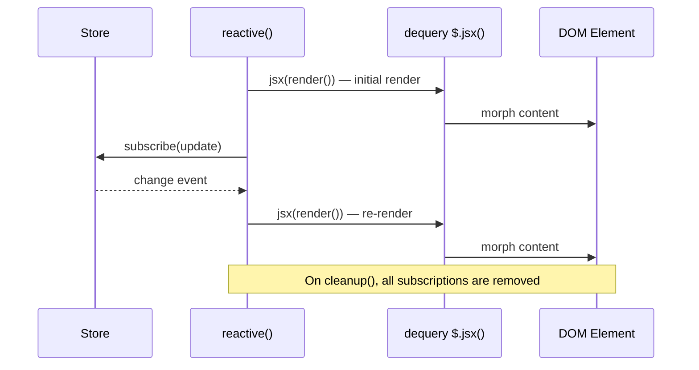

# defuss Book

Reference documentation for LLMs and developers working with the defuss library.

## jsx() Function API

The `jsx()` function creates VNodes from JSX. **Important**: children must be passed via `attributes.children`, not as a separate argument.

### Correct Usage

```tsx
// ✅ Correct: children via attributes.children
jsx("div", { className: "wrapper", children: [<span>Hello</span>] });

// ✅ Also correct: JSX syntax handles this automatically
<div className="wrapper">
  <span>Hello</span>
</div>
```

### For Custom Elements

When dynamically creating custom elements, ensure children are in `attributes.children`:

```tsx
// ✅ Correct way to create custom elements dynamically
const customElement = (tagName: string, props: Record<string, any>, children?: any) => {
    return jsx(tagName, { ...props, children });
};

// Usage
customElement("my-component", { class: "wrapper" }, <span>Content</span>);
```

### jsx() Signature

```ts
jsx(
  type: VNodeType | Function,        // Tag name or component function
  attributes: { children?, ...},      // Props including children
  key?: string,                       // Optional key for reconciliation
  sourceInfo?: JsxSourceInfo         // Dev mode source info
): VNode | VNode[]
```

The 3rd argument is `key`, NOT children. This is a common mistake.

---

## Shadow DOM and Custom Elements

### How Morphing Works

defuss uses a hybrid approach for shadow DOM:

- **Custom elements** (tags containing `-`): morph **light DOM** (slotted content)
- **Regular elements with shadowRoot**: morph **shadow root**

This ensures slotted content updates correctly in web components while preserving shadow DOM behavior for other use cases.

### Slotted Content Updates

Slotted content lives in **light DOM**, not shadow DOM. When you render:

```tsx
<my-card>
  <span slot="header">Title</span>
  <p>Content</p>
</my-card>
```

The `<span>` and `<p>` are light DOM children that get projected into `<slot>` elements in the shadow DOM. defuss correctly updates these by targeting the parent element, not its shadowRoot.

---

## Render Functions

### render (Recommended)

React-compatible render function for morphing JSX into a container:

```tsx
import { render } from "defuss";

render(<App />, document.getElementById("app"));
```

### renderInto (Deprecated)

Alias for `render`. Use `render` instead - `renderInto` will be removed in v4.

### Async render (client/server)

For async rendering with promises:

```tsx
import { render } from "defuss/render/client";
// or
import { render } from "defuss/render/server";

await render(<AsyncApp />, container);
```

---

## Dequery API

### .jsx() / .render()

Renders JSX into the selected element(s):

```tsx
import { $ } from "defuss";

// Both are equivalent - .render() is an alias for .jsx()
$("#app").jsx(<MyComponent />);
$("#app").render(<MyComponent />);
```

### .update() (Deprecated)

Use `.jsx()` or `.render()` instead. Note: `.update()` with props object for component re-rendering is still supported.

---

## Defuss Transition Effects

The defuss framework includes a powerful transition system that allows you to add smooth animations to DOM updates. The transitions are applied to parent elements while preserving defuss's intelligent partial DOM update behavior.

## Basic Usage

```typescript
import { $ } from 'defuss';

// Update with a fade transition
const $element = await $('#my-element');
await $element.update('<div>New content</div>', {
  type: 'fade',
  duration: 300,
  easing: 'ease-in-out'
});
```

## API Reference

### TransitionConfig Interface

```typescript
interface TransitionConfig {
  /** Predefined transition type */
  type?: TransitionType;
  /** Custom CSS-in-JS styles for each transition phase */
  styles?: TransitionStyles;
  /** Duration in milliseconds */
  duration?: number;
  /** CSS easing function */
  easing?: string;
  /** Delay before starting transition in milliseconds */
  delay?: number;
}
```

### Predefined Transition Types

The following predefined transition types are available:

- `'fade'` - Fade in/out effect (default)
- `'slide-left'` - Slide from right to left
- `'slide-right'` - Slide from left to right  
- `'slide-up'` - Slide from bottom to top
- `'slide-down'` - Slide from top to bottom
- `'scale'` - Scale and fade effect
- `'none'` - No transition

### Default Configuration

```typescript
const DEFAULT_TRANSITION_CONFIG = {
  type: 'fade',
  duration: 300,
  easing: 'ease-in-out',
  delay: 0
};
```

## Examples

### 1. Basic Fade Transition

```typescript
await $element.update('<div>New content</div>', {
  type: 'fade'
});
```

### 2. Slide Transition with Custom Duration

```typescript
await $element.update('<div>New content</div>', {
  type: 'slide-left',
  duration: 500,
  easing: 'cubic-bezier(0.4, 0, 0.2, 1)'
});
```

### 3. Custom Transition Styles

```typescript
await $element.update('<div>New content</div>', {
  styles: {
    enter: { 
      opacity: '0', 
      transform: 'scale(0.8) rotate(-90deg)',
      transition: 'all 400ms ease-out'
    },
    enterActive: { 
      opacity: '1', 
      transform: 'scale(1) rotate(0deg)' 
    },
    exit: { 
      opacity: '1', 
      transform: 'scale(1) rotate(0deg)',
      transition: 'all 200ms ease-in'
    },
    exitActive: { 
      opacity: '0', 
      transform: 'scale(1.2) rotate(90deg)' 
    }
  },
  duration: 400
});
```

### 4. Delayed Transition

```typescript
await $element.update('<div>New content</div>', {
  type: 'scale',
  delay: 200,
  duration: 300
});
```

## How It Works

The transition system works by:

1. **Exit Phase**: Applies exit styles to the parent element and waits for the transition to complete
2. **Update Phase**: Performs the actual DOM update using defuss's intelligent `updateDomWithVdom` function
3. **Enter Phase**: Applies enter styles and waits for the transition to complete
4. **Cleanup**: Restores original styles to avoid side effects

### Transition Phases

Each transition has four phases defined by CSS-in-JS style objects:

- **`enter`**: Initial styles when content is entering (before animation starts)
- **`enterActive`**: Target styles for the enter animation
- **`exit`**: Initial styles when content is exiting (before animation starts)  
- **`exitActive`**: Target styles for the exit animation

## Advanced Usage

### Combining with JSX Updates

```typescript
import { jsx } from 'defuss';

const NewComponent = () => jsx('div', {
  style: { padding: '20px', background: '#f0f0f0' }
}, 'Updated with JSX!');

await $element.update(NewComponent, {
  type: 'slide-up',
  duration: 400
});
```

### Error Handling

The transition system includes automatic error recovery:

```typescript
try {
  await $element.update(newContent, { type: 'fade' });
} catch (error) {
  console.error('Transition failed:', error);
  // Original styles are automatically restored on error
}
```

### Performance Considerations

- Transitions are applied to parent elements to avoid interfering with partial DOM updates
- Original styles are stored and restored to prevent side effects
- Fallback timeouts ensure transitions don't hang indefinitely
- The system gracefully degrades when parent elements are not available

## Browser Support

The transition system uses modern CSS features:
- CSS Transitions
- CSS Transforms  
- `transitionend` events

Supported in all modern browsers (IE11+ with some limitations).

## Migration Guide

If you're upgrading from a version without transitions:

### Before
```typescript
await $element.update('<div>New content</div>');
```

### After (with transitions)
```typescript
await $element.update('<div>New content</div>', {
  type: 'fade',
  duration: 300
});
```

The transition parameter is optional, so existing code continues to work without changes.

## Tips and Best Practices

1. **Choose appropriate durations**: 200-500ms work well for most UI transitions
2. **Use CSS easing functions**: `ease-in-out` provides natural feeling animations
3. **Test on slower devices**: Ensure transitions don't impact performance
4. **Provide fallbacks**: The system gracefully handles missing parent elements
5. **Keep it subtle**: Overly dramatic transitions can hurt user experience

## Troubleshooting

### Transition not visible
- Ensure the target element has a parent element
- Check that the parent element is not hidden or positioned in a way that clips the transition
- Verify CSS transition properties are valid

### Performance issues
- Reduce transition duration
- Use `transform` and `opacity` properties for best performance
- Avoid transitioning properties that trigger layout recalculation

### Transition interrupted
- The system automatically handles cleanup if transitions are interrupted
- Original styles are always restored, even on errors

---

## Reactive System in defuss

The reactive system provides a store-driven re-rendering mechanism. It subscribes to one or more `Store` instances and automatically re-renders JSX into a DOM target whenever any of those stores change. There are three APIs for using it:

1. **[`reactive()`](packages/defuss/src/common/reactive.ts)** — Low-level imperative function
2. **[`<Reactive />`](packages/defuss/src/common/reactive-component.tsx)** — Declarative JSX component
3. **`$.reactive()`** — dequery chainable method

```mermaid
graph TD
    A[Store / Store[]] -->|subscribe| B[reactive() core]
    B -->|renders JSX into| C[HTMLElement / Ref]
    D[<Reactive /> component] -->|onMount| B
    D -->|onUnmount| E[cleanup()]
    F[dequery $.reactive()] -->|forEach element| B
```

---

## Explicit Reactivity Helper API

The core imperative utility. It takes a [`ReactiveConfig`](packages/defuss/src/common/reactive.ts) and a DOM target, performs an immediate render, and subscribes to the store(s).

#### Signature

```ts
function reactive(
  config: ReactiveConfig,
  target: Ref<HTMLElement> | HTMLElement
): () => void;
```

#### [`ReactiveConfig`](packages/defuss/src/common/reactive.ts) Interface

| Property    | Type                              | Description                              |
|-------------|-----------------------------------|------------------------------------------|
| `store`     | `Store<any> \| Store<any>[]`     | One or more stores to subscribe to       |
| `render`    | `() => JSX.Element`               | Returns JSX to render into the target    |
| `cleanup?`  | `() => void`                      | Called on unmount                        |

#### Returns
A cleanup function that unsubscribes from all stores and invokes the optional `cleanup` callback.

#### Usage
```ts
import { reactive, createStore, createRef } from "defuss";

const store = createStore({ count: 0 });
const ref = createRef<HTMLDivElement>();

// Call inside onMount or similar lifecycle hook
const cleanup = reactive({
  store,
  render: () => <div>Count: {store.value.count}</div>,
  cleanup: () => console.log("unmounted"),
}, ref);

// Later, call cleanup() to unsubscribe
cleanup();
```

#### Key Behaviors
- **Immediate render**: The `render()` function is called once synchronously before any subscriptions are set up.
- **Multi-store support**: Pass an array of stores to react to changes from any of them.
- **Target flexibility**: Accepts either a `Ref` or a raw `HTMLElement`.
- **Uses dequery internally**: Rendering is done via `$(ref).jsx(config.render())`, which morphs the DOM efficiently.

---

### 2. [`<Reactive />`](packages/defuss/src/common/reactive-component.tsx) Component

A declarative, zero-boilerplate wrapper around [`reactive()`](packages/defuss/src/common/reactive.ts) core function. It handles subscription lifecycle automatically via `onMount` / `onUnmount`.

#### Props ([`ReactiveProps`](packages/defuss/src/common/reactive-component.tsx))
| Property    | Type                              | Description                              |
|-------------|-----------------------------------|------------------------------------------|
| `store`     | `Store<any> \| Store<any>[]`     | Required. Store(s) to subscribe to       |
| `render`    | `() => JSX.Element`               | Required. JSX render function            |
| `cleanup?`  | `() => void`                      | Optional cleanup on unmount              |
| `tag?`      | `string`                          | Wrapper element tag. Default: `"div"`    |
| `className?`| `string`                          | CSS class on the wrapper element         |
| `ref?`      | `Ref<HTMLDivElement>`             | Ref to the wrapper element               |
| `...props`  | `ElementProps<HTMLDivElement>`   | Spread onto the wrapper element          |

#### Usage
```tsx
import { Reactive, createStore } from "defuss";

const store = createStore({ count: 0 });

<Reactive
  store={store}
  render={() => (
    <div>
      <p>Count: {store.value.count}</p>
      <button onClick={() => store.set({ count: store.value.count + 1 })}>
        Increment
      </button>
    </div>
  )}
/>
```

#### With Custom Wrapper Tag
```tsx
<Reactive tag="section" className="counter" store={store} render={...} />
// Renders: <section class="counter">...</section>
```

#### Lifecycle
The component sets up the reactive subscription in its `onMount` callback and tears it down in `onUnmount`.

---

### 3. dequery `$.reactive()` Method

The dequery API exposes [`reactive()`](packages/defuss/src/common/reactive.ts) as a chainable method, applying it to every node in the dequery collection.

#### Usage
```ts
import { $, createStore } from "defuss";

const store = createStore({ count: 0 });

$("#counter-container").reactive({
  store,
  render: () => <span>{store.value.count}</span>,
});
```

This iterates over all matched elements and calls `reactiveUtil(config, el)` on each `HTMLElement`.

---

### When to Use Which API

| API | Best For |
|-----|----------|
| [`reactive()`](packages/defuss/src/common/reactive.ts) | Fine-grained control, imperative setups, custom lifecycle management |
| [`<Reactive />`](packages/defuss/src/common/reactive-component.tsx) | Declarative JSX trees, embedded reactive blocks inside larger components |
| `$.reactive()` | Imperative DOM targeting, attaching reactivity to existing DOM elements by selector |

---

### Architecture



All three APIs converge on the same [`reactive()`](packages/defuss/src/common/reactive.ts) core function, which uses dequery's `$.jsx()` for efficient DOM morphing on every store change.
