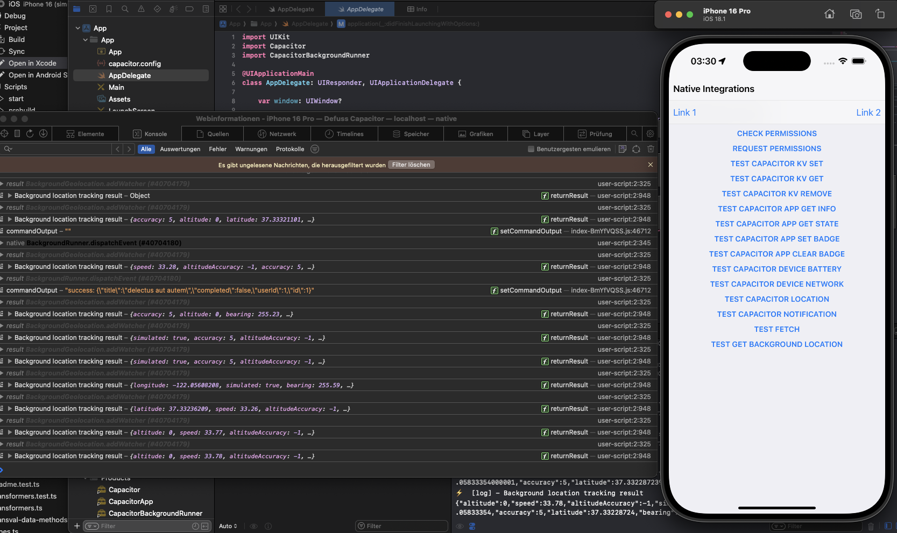
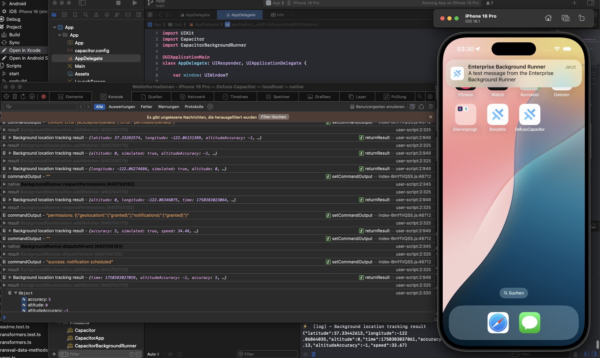
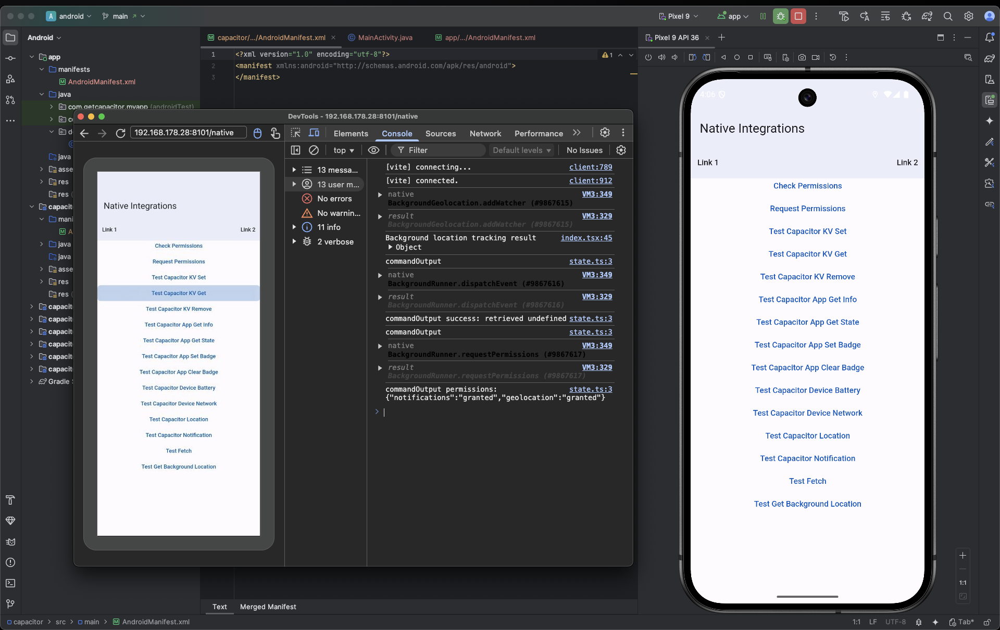

<h1 align="center">


<p align="center">
  <code>defusscapacitor example</code>
</p>

<sup align="center">

`TypeScript` + `defuss` + `Capacitor` + `Framework7` Starter Kit

</sup>









## 🛠️ Setup

### 1. Get a decent package manager

We recommend using `pnpm` as a package manager. It's fast, mature and handles monorepos well. If you haven't installed `pnpm` yet:

```bash
npm i -g pnpm@^9.13.2
```

Then: Install dependencies: `pnpm install`

### VS Code Extension

Install the [`Ionic`](https://marketplace.visualstudio.com/items?itemName=ionic.ionic) extension.
It allows to start the app in a browser, Android, or iOS simulator or device.

### Android

Open Google Chrome and navigate to `chrome://inspect` to see the device.
Inspect the app and open the console to see the logs.

### iOS

Open Safari, enable Developer mode, and navigate to `Develop` > `iOS Device` > `App Name` to see the device.
Inspect the app and open the console to see the logs.

### Capacitor

Open Xcode or Android Studio to see native code logs. (Attach debugger)

## 🧞 Commands

All commands are run from the root of the project, from a terminal:

| Command                   | Action                                           |
| :------------------------ | :----------------------------------------------- |
| `pnpm install`             | Installs dependencies                            |
| `pnpm run start`           | Starts local dev server at `localhost:8100`      |
| `pnpm run build`           | Build your production app to `./dist/`, Android to `./android` and iOS to `./ios` |
| `pnpm run preview`         | Preview your build locally, before deploying     |

## 👀 Want to learn more?

Feel free to check out [Capacitor](https://capacitorjs.com/) and [Framework7](https://framework7.io/).

---


<caption><i><b>Come visit us on <code>defuss</code> Island!</b></i></caption>