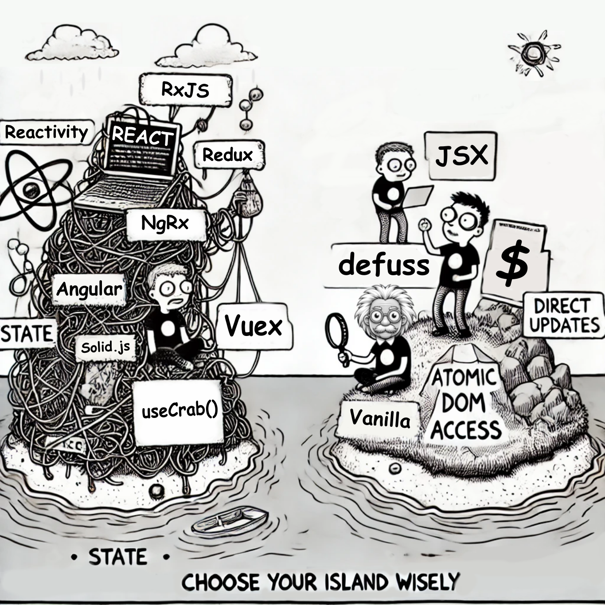

<h1 align="center">


`defuss`

<sup align="center">

Project Creator

</sup>

</h1>

> `create-defuss` is a simple, lightweight CLI tool that enables Git sparse checkouts for subdirectories of GitHub repositories. Originally created to help jump-start projects using **defuss templates**, it can be used for any Git repository.

**💡 Did you know?** With just one command, you can checkout a specific subdirectory from a GitHub repository without cloning the entire project.

---

<h3 align="center">

🚀 Getting Started

</h3>

You're just one step away from checking out specific subdirectories:

### Use the `create-defuss` CLI:

To checkout a subdirectory from a repository, run the following command:

```bash
npx create-defuss <repository-url> [destination-folder]
```

Replace `<repository-url>` with the URL to the GitHub subdirectory you want to checkout (e.g., `https://github.com/user/repo/tree/branch/path`).
Optionally, specify a `[destination-folder]` to customize where the files will be checked out.

#### Example

```bash
npx create-defuss https://github.com/kyr0/defuss/tree/main/examples/with-astro-ts ./my-new-project
```

This will download **only** the code from the `with-astro-ts` subdirectory into the _(new)_ folder `my-new-project`. 

<h3 align="center">

⚙️ API usage

</h3>

You can also use `create-defuss` as library. It's super simple:

```ts
import { performSparseCheckout } from "create-defuss"

// pass in the Git url and desired destination folder (relative to the current working directory)
performSparseCheckout("git_url", "dest_folder")
```


<h3 align="center">

🚀 How does `defuss-vite` work?

</h3>

`create-defuss` is an NPM package with a `bin` entry in `package.json`. This, combined with a "shebang" line (`#!/someshell`) makes it executable using `npx` as a CLI (command line interface). It uses Git sparse checkout to efficiently download files from a specific subdirectory of a GitHub repository. It avoids downloading the entire repository, saving bandwidth and time. Also, monorepo maintainers can spare on creating extra "template" repositories for their example code.

Inside the project, you'll find the following relevant files:

```text
/
├── src/cli.ts
├── src/git.ts
├── package.json
```

## 🧞 Commands

All commands are run from the root of the project, from a terminal:

| Command       | Action                                                                                                                                                                                                                           |
| :------------ | :------------------------------------------------------------------------------------------------------------------------------------------------------------------------------------------------------------------------------- |
| `npm build`    | Build a new version of the plugin. |
| `npm publish`    | Publish a new version of the `defuss-vite` integration package. |

---



<caption><i><b>Come visit us on defuss island!</b></i></caption>