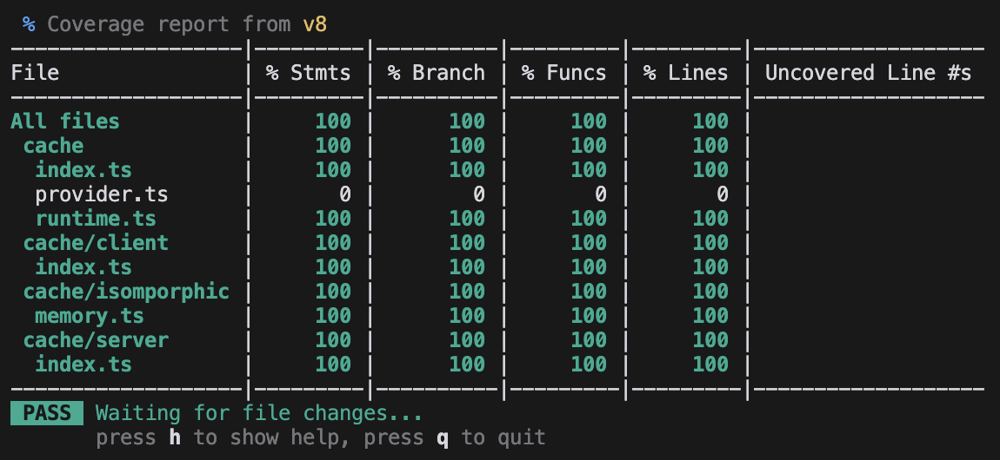

<h1 align="center">


<p align="center">
  <code>defuss</code>
</p>

<sup align="center">

Simplify & Succeed

</sup>

</h1>


> `defuss` is a simple, tiny and modern web framework. It stops  **complexity**, promotes **explicit code**, and brings back the **joy** of building for the web! 😊

<h2 align="center">

Packages

</h2>

**💡 Can you imagine?:** The most important parts of `defuss`, the `defuss/render` and `defuss/dequery` are written in only ~500 Lines of Code all-in! That's why a **production** build is only **2 KiB** in size.

<h3 align="center">

`defuss/render` 

</h3>

The JSX renderer is a core technology of `defuss`. It turns JSX-based HTML/SVG markup like `<div />` and functional components markup like `<MyComponent />` into a lightweight, JSON-based virtual DOM, then renders it via SSR on the server, and the native DOM API in the browser.

Would you have thought that one can squeeze this into only ~320 lines of readable and well documented code?

#### Features:

- ✅ `defuss`' JSX is similar to React/Preact/Solid.js JSX code.
- ✅ It works in-browser and on the server (SSR).
- ✅ `Function`al components like `<Foo />` are fully supported.
- ✅ Fragments `<> <div /><div /> </>` are supported.
- ✅ Refs `ref={btn}` and referencing via `btn.current` is supported.
- ✅ Lifecycle hooks like `onMount={(el) => console.log(el, 'Button added to the DOM!')}` are supported.
- ✅ Supports `innerHTML` mutaton using `dangerouslySetInnerHTML={{ __html: '<... />' }`.
- ✅ It can render whole HTML documents on server-side (SSR), starting with `<html>`.
- ✅ Extremely simple, fast, memory-efficient, and isomorphic implementation.
- ✅ Comes with an API of just three functions: `jsx`, `render`, `renderToString`. 
- ✅ Works with `Vite`, `Astro` and vanilla JavaScript projects.
- ✅ It's tiny! Written in ~320 LoC. ~`2 KiB` all-in (client, gzip).
- ✅ Tree-shakable and side-effect free.
- ✅ Written in modern TypeScript.
- ✅ 100% Unit Test coverage.


#### How does the `defuss/render` it work?

A modern build tool like `Vite` (`Astro` builds on `Vite`) watches for changes in your codebase. When you change your code in your code editor, it will tell a transpiler (e.g. `esbuild`, `swc`, `tsc` or  `babel`) to read the changed code file and turn it into valid JavaScript code for the target runtime (a browser, Node.js, etc.). When this is done, it will pass all JavaScript code to a bundler to create final, optimized products of code. 

Build tools like `Vite` (and also `Astro`) allow developers to hook into that process and inject 3rd party plugins. `defuss/render` is such a plugin. It will use `esbuild` or `babel` to turn the JSX dialect code (think: `<MyComponent foo="bar" />` or `<div></div>`) into a tree of `jsx` function calls (think: `tsx(MyComponent, { foo: "bar" })`). 

The `jsx` function then creates a "virtual DOM" from this, which simply is a JSON object tree that represents the exact same information the JSX stated: `{ "type": MyComponent, "attributes": { "foo": "bar", "children": [] } }` or `{ "type": "div", "attributes": {}, "children": []}`. It will call the functional Components like this: `MyComponent({ ...attributes })` until eventually, only HTML elements remain.

The resulting JSON object tree that describes a HTML tree will then  *replace* the JSX code in the original JavaScript source code file, turning *invalid* JavaScript code, that no browser, Node.js & co. can  handle (because it contains JSX dialect), into perfectly valid JavaScript code. Of course, a user still can't see any element rendered. We're still at the "code transpilation" stage.

Rendering and presenting can only happen in the browser, because only the browser is able to display HTML elements to the user.

Therefore, the browser can either: 

- Receive such a JSON-serialized VDOM tree together with some runtime code so that the `render` function can create a native DOM element for each node in the virtual, JSON-serialized DOM tree. This native DOM tree starts with one or many top-level DOM elements that are then added somewhere in the web page using the `appendChild` API, or

- Receive a serialized HTML string that the browser can *implicity* render, just like a static website. To do that, the virtual DOM must be pre-rendered on the server-side (SSR use-case). However, the `render` function cannot use the native DOM API on the server, because it is not available. Therefore `linkedom`, a DOM API implementation that works on the server and emulates a native DOM API, is used. When done, `renderToString` is called for every resulting top-level DOM element to turn it into a HTML string a browser can display directly. 

---
---


<h3 align="center">

`defuss/cache` 

</h3>

Using `localStorage` and `sessionStorage` for caching might seem straightforward, but there are several challenges to consider. Modern browsers have private modes with security and quota limitations, which can lead to errors when attempting to write data. Additionally, in server-side rendering (SSR) environments, these APIs are unavailable, necessitating a fallback mechanism.

All of these challenges can be addressed in just a few lines of clear and well-documented code.

#### Features:

- ✅ Write to storage using simple key/value API
- ✅ Middleware function API allows to hook what is read and written
- ✅ Isomorphic, works in-browser and in Node.js
- ✅ Supports `localStorage`
- ✅ Supports `sessionStorage`
- ✅ Supports in-memory as an automatic fallback
- ✅ Exposes the backend API reference of each storage provider for low-level API access
- ✅ Tree-shakable, side-effect free
- ✅ First class TypeScript support
- ✅ Zero dependencies
- ✅ 100% Unit Test coverage



#### How to use `defuss/cache`?

```ts
import { cache } from 'defuss'

const demoCache = cache('memory') // alternatives: 'local' | 'session' | 'memory'

// store a value
demoCache.set('abc', 123)

// read a previously stored value, if not existing, return the default (0)
const valueStored = demoCache.get('abc', 0)

// remove a single value
demoCache.remove('abc')

// delete all values
demoCache.removeAll()
```

#### How does the `defuss/cache` work?

The `defuss/cache` module provides a isomorphic (aka. "runs everywhere") API for caching across different JavaScript runtime environments, using `localStorage`, `sessionStorage`, and in-memory storage. 

- **What**: It offers a simple key/value API for storage operations, supports middleware for custom read/write logic, and provides a fallback to in-memory storage when `localStorage` or `sessionStorage` are unavailable.
  
- **Why**: This design ensures compatibility in both browser and server-side environments, addressing limitations like private mode restrictions and SSR unavailability of web storage APIs.

- **Where**: 
  - In the browser, it uses `localStorage` and `sessionStorage` through the [`WebStorageProvider`](./src/cache/client/index.ts) class.
  - On the server, it defaults to in-memory storage, ensuring that caching is always possible regardless of the environment, as seen in the [`server/index.ts`](./src/cache/server/index.ts).
  - The logic for determining the storage provider is encapsulated in the [`getPersistenceProvider`](./src/cache/client/index.ts) function, which selects the appropriate storage mechanism based on the runtime context.

---
---

<h3 align="center">

`defuss/dequery`

</h3>

As `defuss/render` only renders **once** _(and therefore is static)_, we need an elegant way to change the DOM in case of user interaction. The `dequery` package implements a thin abstraction API around the official DOM APIs that resembles the classic, chaining `jQuery` API. 

#### Features:

- ✅ Ultra-fast: Usually uses `ref` instead of DOM CSS selector queries
- ✅ Querys elements using native CSS selectors (`document.querySelector`)
- ✅ Works well with direct element references
- ✅ Can render HTML and VDOM
- ✅ Caches results in property `.el` 
- ✅ Supports the most important jQuery methods
- ✅ It's tiny! Only ~175 LoC
- ✅ Zero dependencies
- ✅ First class TypeScript support
- ✅ Unit Test coverage almost 100%


<h2 align="center">API docs</h2>

This is how using `defuss/dequery` looks like:

```tsx
import { $, type Ref, jsx, type Props } from "defuss";

interface SomeCustomInputProps extends Props {
  name: string;
}

const SomeCustomInput = ({ name }: SomeCustomInputProps) => {

  const inputRef: Ref = {};
  
  const onBlur = () => {
    $(inputRef).val(Math.random());
    console.log('Value after blur:', $(inputRef.current).val());
  }
  return <input ref={inputRef} name={name} onBlur={onBlur} />
}
```


<h3 align="center">Selector</h3>

Method        | Examples        
------------- |------------- 
`$(ref: Ref)` | Get an element by `Ref` reference: `$(ref)`
`$(el: Element)` | Get an element by `Element` reference: `$(el)`
`$(cssSelector: string)` | Get an element by CSS selector: `$("#app")`

<h3 align="center">DOM manipulation</h3>

Method        | Examples        
------------- |------------- 
`attr` | Get an attribute of a checkbox: `$(formInputRef).attr('tabIndex')`
`attr` | Set an attribute of an input element: `$(formInputRef).attr('tabIndex', '2')`
`val` | Get a value of a checkbox: `$(formInputRef).val()`
`val` | Set the value of an input element: `$(formInputRef).val(2)`
`html` | Render VDOM and replace the DOM *children* of an element: `$(formInputRef).html(<div>Something else</div>)` or `$(formInputRef).html("<div>HTML string</div>")`
`replaceWith` | Render DOM and replace the DOM element *itself* with it: `$(formInputRef).replaceWith(<div>Something else</div>)` or `$(formInputRef).html("<div>HTML string</div>")`
`empty` | Remove all children of an element: `$(formInputRef).empty()`
`remove` | Remove the element itself from it's DOM parent node: `$(formInputRef).remove()`

<h3 align="center">DOM events</h3>

Method        | Examples        
------------- |------------- 
`on` | Add a DOM event listener programmatically: `$(formInputRef).on('click', (evt: MouseEvent) => { console.log('clicked on', evt.target) })`
`off` | Remove a DOM event listener programmatically: `$(window).on('resize', (evt: ResizeEvent) => { console.log('browser resized!', window.innerWidth) })`

<h3 align="center">CSS</h3>

Method        | Examples        
------------- |------------- 
`addClass` | Add one CSS class: `$(formInputRef).addClass('outlined')`
`addClass` | Add many CSS classes: `$(formInputRef).addClass(['button', 'mobile'])`
`removeClass` | Remove one CSS class: `$(formInputRef).removeClass('outlined')`
`removeClass` | Remove many CSS classes: `$(formInputRef).removeClass(['button', 'mobile'])`
`toggleClass` | Toggles a CSS class: `$(formInputRef).toggleClass('button')`
`hasClass` | Returns `true` if the CSS class can be found on the element: `$(formInputRef).hasClass('button')`

---


<caption><i><b>Come visit us on defuss island!</b></i></caption>