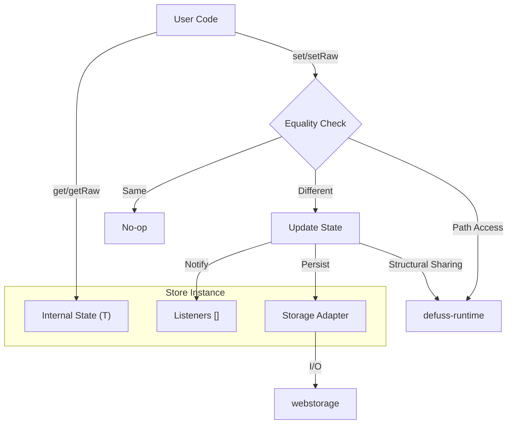

# `defuss` Store Architecture

The `defuss` store is a lightweight, isomorphic state container designed for performance and simplicity. It supports path-based access, fine-grained updates, and pluggable persistence.

## Architecture

The store is built on a closure-based design to ensure encapsulation. It delegates deep property access to `defuss-runtime` and persistence to the `webstorage` module.



### Core Components

1.  **State Closure**: The state `T` is held in a local variable, inaccessible directly from outside.
2.  **Equality Strategy**: Configurable strategy determines when to trigger updates.
    *   **Shallow (Default)**: High-performance O(1) identity check (`Object.is`). Ideal for immutable state patterns (React-like).
    *   **Deep (Opt-in)**: Recursive O(N) JSON check. Useful for when precision is more important than performance.
3.  **Path Engine**: Uses `setByPath` from `defuss-runtime` to perform immutable updates (structural sharing).
4.  **Persistence**: Lazily initialized adapter for `localStorage`, sub-stores, etc.

## Dependencies

*   **`defuss-runtime`**: Provides `getByPath` and `setByPath`.
*   **`webstorage`**: Handles storage abstraction.

## Complexity & Performance Analysis

Measurements collected via Vitest benchmarks (Node.js V8).

| Operation | Complexity | Ops/sec (approx) | Description |
| :--- | :--- | :--- | :--- |
| **`getRaw()`** | **O(1)** | ~47M | Direct variable access. |
| **`setRaw()`** (default) | **O(1)** | ~46M | Shallow identity check. |
| **`createStore`** | **O(1)** | ~3M | Factory overhead. |
| **`get(path)`** | **O(L)** | ~3.5M | Path traversal. |
| **`set(path)`** | **O(L)** | ~1.1M | Clones objects along path (structural sharing). |
| **`setRaw()`** (deep) | **O(N)** | ~11K | Full recursive check. **~4000x slower** than default. |

> **Note**: The default `shallowEquals` provides a ~4000x check-speed improvement over deep equality for large objects.

## Usage Guide

### Basic Usage (Default / High Performance)

Stores use **shallow equality** by default. This means updates only fire if the new value is a different reference (or primitive value) than the current one. This encourages immutable data patterns.

```ts
import { createStore } from "defuss";

// Default: shallow equality (fast)
const store = createStore({ count: 0 });

// ✅ Triggers update (new reference)
store.setRaw({ count: 1 });

// ❌ No update (same reference), even if content "looks" same
const sameRef = store.getRaw();
store.setRaw(sameRef); 
```

### Precision Mode (Deep Equality)

For scenarios where you want updates rejected if the *content* is identical (even if references differ), opt-in to `deepEquals`.

```ts
import { createStore, deepEquals } from "defuss";

// Opt-in to deep equality (slower, but precise)
const store = createStore({ data: { complex: true } }, { equals: deepEquals });

// ❌ No update (content matches, despite new object ref)
store.setRaw({ data: { complex: true } });
```

### Persistence
```ts
// Persist to localStorage
store.persist("my-app-state");
store.restore("my-app-state");
```