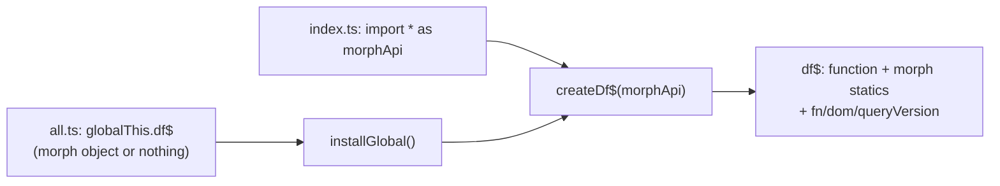

# defuss-query — Architecture

What this package is, why it is shaped the way it is, and where the seams are.
Read this before changing `src/`; the README is the public contract and stays
normative for behavior.

## 1. Purpose and design philosophy

defuss-query is a tiny, native-DOM, Array-based, jQuery-shaped facade over the
defuss-morph engine. It exists so that code written in the jQuery idiom
(`df$(".card").addClass("ready").on("click", ...)`) runs directly against the
same morph engine the rest of defuss uses — no second reconciler, no second
event system, no second mental model.

The philosophy is a **deliberate subset, not a jQuery clone**:

- Native CSS selectors only (`querySelectorAll`, `matches`). There is no
  selector engine, and never will be.
- No AJAX, no Deferred/promise framework, no reactive store, no effects. State
  and asynchrony are the caller's problem, expressed with platform primitives.
- One runtime peer dependency: `defuss-morph ^0.1.1`. Everything structural
  (parse, render, reconcile, events, cleanup, transitions) is delegated to it.
  Query never embeds, forks, or patches the engine; inherited limitations
  (SVG/MathML/template reconciliation, delegated propagation semantics) remain
  inherited and are documented, not worked around.
- Explicitness over magic: snapshot collections (no live NodeLists, no hidden
  requery), no `.end()` stack, no thenable collection, no implicit `px`, no
  JSON coercion in `.data()`.

## 2. The dual nature of `df$`

`df$` is simultaneously a **callable factory** (creates `DfQuery` selections)
and the **morph API namespace** (`df$.morph(...)`, `df$.renderMarkup(...)`,
etc.). Two constructors produce this value, in `src/query.ts`:



- `createDf$(morphApi)` builds the function, then **copies every own key** of
  the morph API onto it with `defineProperty`. Intrinsic `Function` slots
  (`name`, `length`, `prototype`, `caller`, `arguments`) and query's reserved
  slots (`fn`, `dom`, `queryVersion`) are skipped so the result is still a
  well-formed function. `df$.fn` is `DfQuery.prototype`; `df$.dom` is the
  structural adapter; a `Symbol.for("defuss-query.factory")` brand marks it.
- `installGlobal()` implements the **global upgrade contract**:
  - Already branded → return the installed function (second entry is a no-op).
  - Existing `df$` is an unrelated function → throw; never silently destroy
    someone else's global.
  - Existing `df$` is the plain morph object (morph loaded first) → fold its
    properties into a new callable, preserving morph function identities.
  - Nothing there (query first) → install a callable over an empty object;
    selectors work immediately, structural calls throw "load defuss-morph"
    until morph hydrates the global. This direction requires morph >= 0.1.1,
    whose loader preserves a function-valued `df$`; older builds overwrite it.

Dependency injection via `createDf$` (exported from `defuss-query/core`) keeps
the core free of globals and lets consumers supply their own morph instance.

## 3. Collection semantics: `DfQuery extends Array`

`DfQuery<T>` is a real `Array` subclass, not an array-like wrapper.

- **Snapshot membership**: the constructor dedupes via `Set` and pushes in
  stable encounter order (loop-push, not spread, to avoid argument limits).
  Membership is fixed at construction; there is no live requery.
- **`Symbol.species => Array`**: without this, `map`/`slice`/`flat` would
  invoke the `DfQuery` constructor with Array's numeric length argument and
  break. Species-based methods therefore return plain arrays; only explicitly
  overridden methods (`find`, `filter`) return selections.
- **jQuery-style `each`**: `(index, element)` argument order with `this`
  bound to the element, `return false` breaks — intentionally different from
  native `forEach`, matching jQuery muscle memory.
- **Return-shape rule**: traversal (`find(css)`, `parent`, `children`,
  `closest`, `next`, `prev`, `eq`, `first`, `last`) returns a **new**
  selection; scalar setters (`attr`, `prop`, `css`, class/value/content
  methods, `on`/`off`/`trigger`) return **`this`** for chaining.
- Because it is a real Array, native mutators (`.push()`) can defeat the
  initial dedupe. That is accepted: managed selections come from the
  factory/traversal methods; raw Array access is the escape hatch.

## 4. The structural adapter (`src/dom.ts`)

Morph exposes parse/render/reconcile/event/lifecycle primitives but **no
insert/remove primitives** — it only morphs content into an existing element.
Query needs exact operations (`append`, `prepend`, `before`, `after`,
`replaceWith`, `remove`, Text writes), so `createDomAdapter(api)` bridges the
gap. It is an adapter, not a second reconciler:

| Delegated to morph | Done natively in the adapter |
| --- | --- |
| `htmlStringToVNodes` (HTML parsing, with table/select wrapper fix-ups) | `insertBefore` / `removeChild` for exact positions |
| `getRenderer(doc).createElement/createTextNode` (VNode → DOM) | `cloneNode(true)` for multi-target copies |
| `morph()` reconciliation, diff mode, transitions | `nodeValue` writes for Text/CDATA targets |
| Delegated events: `registerDelegatedEvent`, `removeDelegatedEvent`, `getRegisteredEventTypes`, `clearDelegatedEvents(Deep)` | Cross-root move re-arm (register+remove a noop per type so upstream root listeners re-attach after a Document/ShadowRoot change) |
| Lifecycle: `handleLifecycleEventsForOnMount` | Batch validation (reject inserting an ancestor into its descendant before any write) |

Key details:

- `rootOf(el)` implements morph's shadow rule: regular elements with an open
  `shadowRoot` address the shadow root; custom-element hosts (tag contains
  `-`) keep light-DOM targeting.
- Every document touch goes through `documentOf()`/`ownerDocument` and
  document-realm constructors (`DOMParser`, `FormData`, `CustomEvent`), so
  cross-document and iframe contexts work and no realm is assumed global.
- The adapter is deliberately shaped so it can **move upstream into morph**
  later without changing the chain API — `df$.dom` exposes it publicly today.

## 5. Events

Two registries, one per substrate:

```mermaid
flowchart TD
    ON["on(type, handler)"] --> Q{isElement(target)?}
    Q -->|yes| M["morph registerDelegatedEvent<br/>{multi:true, capture}"]
    Q -->|"no (Document/Window/other)"| N["native addEventListener<br/>+ WeakMap registry"]
    OFF["off(type?, handler?)"] --> Q2{isElement?}
    Q2 -->|yes| M2["morph remove/clearDelegatedEvents<br/>(both phases, incl. VNode handlers)"]
    Q2 -->|no| N2["removeEventListener for<br/>matching WeakMap entries only"]
```

- **Elements always go through morph's delegation registry** (`multi: true`);
  there is no parallel element registry. Consequences, all documented in the
  README: `event.currentTarget` may be the delegation root (use `this`);
  `.off()` also removes VNode-declared handlers; external native listeners are
  never touched; detached-element handlers activate once attached under a
  supported delegation root; morphs preserve handlers on surviving nodes.
- **Non-element EventTargets** cannot be delegated, so they get plain
  `addEventListener` plus a small module-level
  `WeakMap<EventTarget, Listener[]>` (`nativeListeners`) purely so `.off()`
  can find and remove exactly what `.on()` added.
- `.on()` accepts `capture` only; any other option key throws — unsupported
  jQuery/native options are rejected loudly instead of half-emulated.
- `.trigger(type, detail)` dispatches a fresh realm-correct `CustomEvent`
  (`bubbles: true`, `cancelable: true`, `composed: false`). No native
  activation, no trusted input, no default-action emulation.

## 6. Entry points and builds

| Entry | File | Contract |
| --- | --- | --- |
| Library | `src/index.ts` | Imports the `defuss-morph` peer, exports `createDf$(morphApi)`. Side-effect-free: no global writes, no `document` reads at import; SSR-safe. Shipped as ESM + CJS with per-condition declarations. |
| Browser ESM | `src/all.ts` | `installGlobal()`; **zero runtime imports, morph not embedded**. Sequential module imports define load order. |
| Ambient types | `src/global.ts` | Opt-in `declare global` for `df$`; normal imports never pollute globals. |
| Classic script | `dist/global.min.js` | IIFE build of `all.ts` for deterministic non-module loading. |

The bundler in `scripts/build.ts` is a **custom AST filter, not a generic
bundler**: the browser graph is a closed set of exactly three modules
(`dom`, `query`, `all`), already type-checked and emitted by `tsc`. The script
parses each emitted file with the TypeScript compiler API, drops
import/re-export declarations and (for `dom.ts`) redundant export modifiers,
prints, concatenates, and minifies with Terser — `all.js` (readable ESM),
`all.min.js`, and the IIFE `global.min.js`. This is safe only because the
module set and its import shape are fixed; do not add modules to the browser
graph without extending the script. `scripts/verify.ts` then enforces the
shipping contract: version agreement across package.json/`QUERY_VERSION`/
stats, artifact presence, freshly recomputed sizes, byte budgets
(<= 4.5 KiB gzip and <= 13,000 raw for the browser bundles), no external
imports and no embedded engine markers in browser bundles, and valid source
maps. `dist/stats.json` is the machine-readable size record.

## 7. Testing strategy

Two vitest projects (`vitest.config.ts`), run against the **installed
workspace morph peer** — never a mock or vendored snapshot:

- **node project**: DOM-free API/import semantics (`tests/node.test.ts`).
- **browser project**: real headless Chromium via
  `@vitest/browser-playwright`. This is the authoritative bed:
  - the 67-case DOM suite (`tests/suite.browser.test.ts`) runs against each
    of the three shipped browser artifacts (`all.js`, `all.min.js`,
    `global.min.js`) — loaded as blob scripts — **plus one run against the
    source modules** through the instrumented dev server, so v8 coverage
    attributes to `src/**/*.ts` (bundles are uninstrumented);
  - 6 load-order tests (`tests/load-order.browser.test.ts`) covering every
    morph/query script combination from a pristine `df$` global;
  - the interactive example test drives `examples/` end to end.
- The `serve-morph` vite plugin exposes the resolved workspace morph package's
  `dist/` under `/__morph__/` (with path-escape protection), so tests load
  the real engine bundle with plain script tags.
- **Type tests**: `tsc --noEmit` over `tests/` (positive and `@ts-expect-error`
  negative cases).
- **Packed-consumer tests** (`scripts/package-tests.ts`): `npm pack` into a
  temp dir, then verify the tarball contains no dev fixtures, ESM and CJS
  root/core imports work with peer resolution and no global side effects, and
  strict NodeNext `.mts`/`.cts` consumers (including the opt-in global types)
  compile.

`bun run check` = build → typecheck → test (with coverage) → test:package →
verify.

## 8. Release flow

Release is `npm publish` only. `prepublishOnly` runs the full `check`
pipeline, so a publish cannot ship unbuilt, untested, or over-budget
artifacts. There are no release folders, no committed coverage or size
reports, and no release tooling beyond npm itself; `dist/` is regenerated by
the build and `stats.json` recomputed and re-verified on every run.
