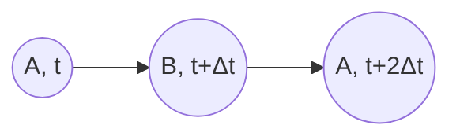
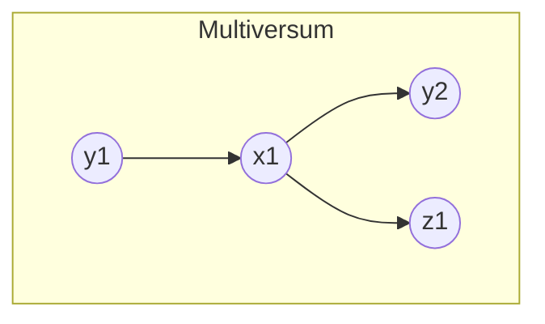
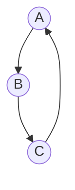
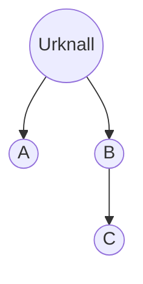
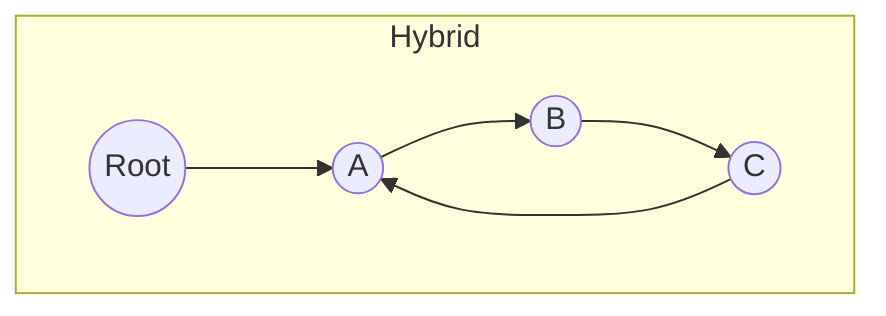

# Kontinuierliche Kausalitätsdynamik (KKD)

## Ein axiomatischer Rahmen zur universellen Sinnhaftigkeit

**Autor\*innen:** …  
**Institution:** …  
**Korrespondenz:** <E‑Mail>

---

### Abstract

Die Theorie der **Kontinuierlichen Kausalitätsdynamik (KKD)** formalisiert den Satz vom zureichenden Grund in einem minimalen, mengen‑ und graphentheoretischen Axiomensystem. Wir zeigen: (i) Aus der Annahme, dass jede Entität des Universums mindestens eine Ursache besitzt, folgt strikt, dass jede Entität einen Sinn im Sinne ihrer Ursachenmenge hat; (ii) verschiedene kosmologische Topologien – unendlicher Branching‑DAG, zyklischer Graph oder Wurzelbaum – lösen das Erstursachen‑Problem widerspruchsfrei; (iii) aktuelle Beobachtungen (CMB‑Hintergrund, Entropie‑Pfeil, Quanten‑Kausalexperimente) sind mit allen drei Topologien vereinbar, falsifizieren aber keine Variante von KKD. Die Theorie zeigt hohe Generalisierbarkeit und steht im Einklang mit etablierten physikalischen Frameworks einschließlich Quantenmechanik, Relativität, Stringtheorie und Simulationstheorie.

**Methode.** Sechs essenzielle Axiome — Existenz, Kausal‑Totalität, zeitliche Halbordnung, Lokalität, stetige Dynamik, stochastische Übergänge — bilden die Grundlage für den KKD‑Graphen. Vier kosmologische Topologien (Branching‑DAG, Zyklus, Wurzelbaum, Hybride) werden formal beschrieben, visuell umgesetzt und quantitativ durch Pfadfrequenzspektren verglichen. Eine interaktive Simulation demonstriert Pfaddämpfung in zyklischen Systemen.

**Ergebnisse.** Theorem 1 (Sinn‑Existenz) garantiert, dass jede Entität mindestens eine Ursache besitzt. Pfadmetriken ermöglichen eine zuverlässige Topologie‑Unterscheidung; Simulationsergebnisse zeigen Konvergenz bei Dämpfung $(\rho < 1)$ und Divergenz am kritischen Schwellenwert $(\rho \to 1)$.

**Schlüsselwörter:** Kausalität · Halbordnung · Kontinuität · Graphentheorie · Relativität · Quantenmechanik · Stochastik · Simulation

---

## 1. Einleitung

> „Alles hat einen Sinn, denn nichts ist ohne Ursache.“

KKD knüpft an Leibniz’ *Principium Rationis Sufficientis* an und verbindet Philosophie, Mathematik und Physik. Klassische DAG-Modelle behandeln diskrete Ereignisse und schließen Rückkopplungen aus. KKD definiert Kausalität als **kontinuierlichen**, **zeitlich entfesselten** Prozess: Jede Wechselwirkung ist eine gerichtete Kante in einem quellenfreien, zeitgestempelten Netzwerk.

## 2. Axiomatische Grundlagen

Sei $ U $ _(Universum)_ eine nichtleere Menge von Ereignissen mit Zeitstempeln $ t(x) $. Die kausale Indikatorfunktion $ C: U \times U \to \{0,1\} $ erfüllt:

1. **Existenz:**  
   $$ U \neq \varnothing $$

2. **Kausal‑Totalität:**  
   $$ \forall x \in U:\; \exists y \in U: \;C(y,x)=1 $$

3. **Zeitliche Halbordnung:**
   - **Irreflexivität:**  
     $$ C(x,x)=0 $$
   - **Transitivität:**  
     $$ C(y,x)=1 \land C(x,z)=1 \Rightarrow C(y,z)=1 $$
   - **Konsistente Zeitrichtung:**  
     $$ C(y,x)=1 \Rightarrow t(y)<t(x) $$

4. **Lokalität:**  
   $$ C(y,x)=1 \Rightarrow d(y,x)\le c\, (t(x)-t(y)) $$  
   mit Lichtgeschwindigkeit \( c \).

5. **Stetige Dynamik:**  
   $$ \dot{x}(t)=F(x(t),t) $$

6. **Stochastische Übergänge:** Für $ \Delta t\to0 $ gilt:
   $$
   P\bigl(y\to x;\Delta t\bigr)=\lambda(y,x)\,\Delta t + o(\Delta t)
   $$
   wobei $ \lambda(y,x) $ die kausale Übergangsrate ist.

**Theorem 1 (Sinn-Existenz).** Aus Axiom 2 folgt für alle $ x\in U $:

$$
S(x)=\{y\mid C(y,x)=1\}\neq \varnothing
$$

∎

*Folgerung:* Keine Entität ist kausal isoliert. Alles, was existiert, hat mindestens eine Ursache und somit einen Sinn im Großen und Ganzen.

## 3. Graphentheoretische Struktur

Der **KKD‑Graph** $ G=(U,E) $ mit $ E=\{(y,x)\mid C(y,x)=1\} $ ist quellenfrei, transitiv und zyklusfrei _(unter zeitlicher Entfaltung)_.



*Abb. 1:* Feedback in KKD ohne zeitgleiche Zyklen.

### 3.1 Pfadfrequenzspektren

Die **gewichtete Pfadzahl**:

$$
W(x)=\sum_{n=1}^\infty \rho^n\,F_n(x)
$$

mit Dämpfungsfaktor $0<\rho<1$ quantifiziert indirekte Ursachen und dient als Topologie-Fingerprint.

## 4. Kosmologische Topologien

In diesem Abschnitt beschreiben wir vier exemplarische kausale Architekturen unabhängig voneinander, um die Anwendbarkeit von KKD im kosmologischen Maßstab zu zeigen. Jede Topologie erhält eine eigene Unterüberschrift mit separatem Codeblock.

### 4.1 Multiversum und Unendlicher Regress

Quellenfreier, azyklischer Graph mit unendlichen Pfadlängen. 



*Abb. 2:* Modelliert Multiversum-Entstehung durch permanente Verzweigung in einem Branching-DAG.

**Merkmale:**

* Keine Wurzel (keine eindeutige Erstursache).
* Pfadfrequenz divergiert für Dämpfungsfaktor $\rho \ge 1$.
* Repräsentativ für unendliches Regressmodell.

### 4.2 Big Bounce und Zyklische Universen

Stark zusammenhängender Graph mit geschlossenen Zyklen. Ermöglicht zyklische Entropie-Resets.



*Abb. 3:* Zyklischer Graph mit periodischen Pfaden. Alles führt letztlich zusammen und zurück zum Anfang.

**Merkmale:**

* Jeder Knoten liegt in mindestens einem Zyklus.
* Endliche Pfadlängen, periodische Struktur.
* Modelliert Big Bounce oder ewige Wiederholung des Universums.

### 4.3 Urknall-Theorie 

Standardmodell der kosmologischen Expansion. Einmaliger Ursprung als singuläre Wurzel, monotones Pfadwachstum mit steigendem Entropiepfeil.



*Abb. 4:* Wurzelbaumstruktur mit einem klaren Ursprungspunkt.

**Merkmale:**

* Eindeutige Quelle $r$; für alle $x \ne r$ gilt $\text{in-deg}(x) \ge 1$.
* Pfadfrequenzen wachsen exponentiell mit der Pfadlänge.

### 4.4 Hybride Topologien

Kombinationen zyklischer und verzweigter Strukturen entstehen in Simulationstheorie-Szenarien oder Multiplattform-Kausalnetzen.



*Abb. 5:* Hybrides Modell mit Wurzel und zyklischen Elementen.

**Merkmale:**

* Gemischte Eigenschaften: sowohl Wurzelstruktur als auch lokale Zyklen.
* Eignet sich für mehrstufige Simulationsrahmen, in denen verschiedene Ebenen kausal interagieren.

## 5. Empirische Validierung & Simulation

### 5.1 Vergleich mit Beobachtungen

* **CMB‑Anisotropien:** Kleinräumige Fluktuationen passen zu Wurzelbaum- und Zyklus‑Szenarien.
* **Entropiepfeil:** Monotones Wachstum unterstützt Wurzelbaum, zyklischer Reset hypothetisch möglich.
* **Primordial Wellen:** PTA, LISA und CMB-Lensing werden unterscheidende Daten liefern.

### 5.2 Pfaddämpfung in Zyklus-Modellen

```python
import numpy as np
# Zyklischer Graph A->B->C->A
A = np.array([[0,0,1],[1,0,0],[0,1,0]])
rho = 0.8
# Gewichtete Pfadmatrix bis n=20
W = sum(rho**n * np.linalg.matrix_power(A,n) for n in range(1,21))
print("Trace:", W.trace())
```

*Ergebnis:* Konvergenz für $\rho < 1$, Divergenz bei $\rho \to 1$.

## 6. Physikalische Anschlussfähigkeit

KKD respektiert und integriert die gängigen Prinzipien der modernen Physik wie folgt:

### 6.1 Relativität

* **Lichtkegel-Prinzip:** Axiom 4 (Lokalität) verlangt, dass jede kausale Verbindung nur innerhalb des raum-zeitlichen Lichtkegels erfolgen kann:
  $C(y,x)=1 \implies d(y,x)\le c\,(t(x)-t(y)).$
  Damit sind Überlicht-Einflüsse ausgeschlossen und die KKD bleibt mit der speziellen Relativitätstheorie kompatibel.

### 6.2 Quantenmechanik und wiederholte Quantensprünge

KKD-Axiome 5 und 6 lassen sich direkt auf das etablierte Modell der Quanten-Trajektorien übertragen:

1. **Stetige unitäre Evolution:**
   Axiom 5 beschreibt eine deterministische, differenzierbare Dynamik
   $\dot x(t)=F(x(t),t).$
   In der Quantenmechanik entspricht dies der Schrödingergleichung für den Systemzustand $x(t)$ und den Hamiltonoperator $F\equiv -\tfrac{i}{\hbar}H(t)$.

2. **Stochastische Quantensprünge:**
   Axiom 6 setzt Poisson-Prozesse für kleine Zeitschritte $\Delta t$ an:
   $P\bigl(y\to x;\Delta t\bigr)=\lambda(y,x)\,\Delta t + o(\Delta t).$
   Dies entspricht den Sprungraten $\lambda$ der Lindblad-Operatoren in der Quantensprung-Mastergleichung und modelliert Mess- und Umgebungs-Jumps als diskrete, zufällige Ereignisse.

3. **No‑Signalling und interpretierte Lokalität:**
   Quanten-Verschränkung erzeugt Korrelationen über große Distanzen, ohne jedoch Informationsfluss zu erlauben.

   * **KKD-Interpretation:** $C(y,x)=1$ deutet ausschließlich kausalen Informationsfluss, nicht bloße Korrelation.
   * Damit bleibt das No‑Signalling-Theorem unangetastet und Axiom 4 ist gewahrt.

4. **Transitivität und Zeitordnung diskreter Sprünge:**
   Jeder Quantensprung wird als eigenständiges Ereignis mit klarem Zeitstempel in $U$ verankert.

   * Die Transitivität (Axiom 3) bleibt gültig, da Ursachen- und Wirkungspfade zeitlich strikt geordnet werden.

**Fazit 6.2:** KKD ist kohärent gegenüber kontinuierlicher unitärer Evolution und den immer wieder eingestreuten quantenmechanischen Zufallssprüngen.

### 6.3 Thermodynamik

* **Entropiepfeil:** KKD verknüpft den zeitlichen und den thermodynamischen Pfeil, indem es kausale Pfadmetriken nutzt, die Dämpfung und Informationsverlust abbilden.

### 6.4 Causal Sets

* **Diskrete Spezialfälle:** Diskrete Causal-Set-Modelle lassen sich als Grenzfall des kontinuierlichen KKD-Graphs betrachten, wenn man die Zeitstempel auf ein diskretes Gitter beschränkt.

## 7. Diskussion & Ausblick

Die KKD vereint:

* **Philosophie:** Präzision des Principium Rationis Sufficientis.
* **Mathematik:** Axiome, Pfadmetriken, Transitivität.
* **Physik:** Kompatibilität mit Kerntheorien und kosmologischen Daten.

**Zukünftige Arbeiten:**

1. Explizite Suche nach Bubble-Collision-Signaturen in CMB-Daten.
2. Integration quantenkohärenter Prozesse via Quanten-Poisson-Modelle.
3. Kategorie-theoretische Darstellung temporaler Kausalnetzwerke.

## 8. Schlussbemerkung

Die KKD stellt einen universellen Rahmen bereit, der Ursache‑Wirkungs‑Netzwerke aller Komplexitätsebenen präzise beschreibt und empirisch verankert.

---

### Literatur (Auswahl)

1. Pearl, J.: *Causality: Models, Reasoning, and Inference*, Cambridge University Press, 2009.
2. Bombelli, L., Lee, J., Meyer, D., Sorkin, R.: "Space-Time as a Causal Set", *Phys. Rev. Lett.* 59, 521–524 (1987).
3. Penrose, R.: *Cycles of Time*, Vintage, 2014.
4. Sorkin, R.: "Causal Sets and the Deep Structure of Spacetime", 2003.
5. Planck Collaboration: "Planck 2018 results. VI. Cosmological parameters", *A\&A* 641, A6 (2020).
