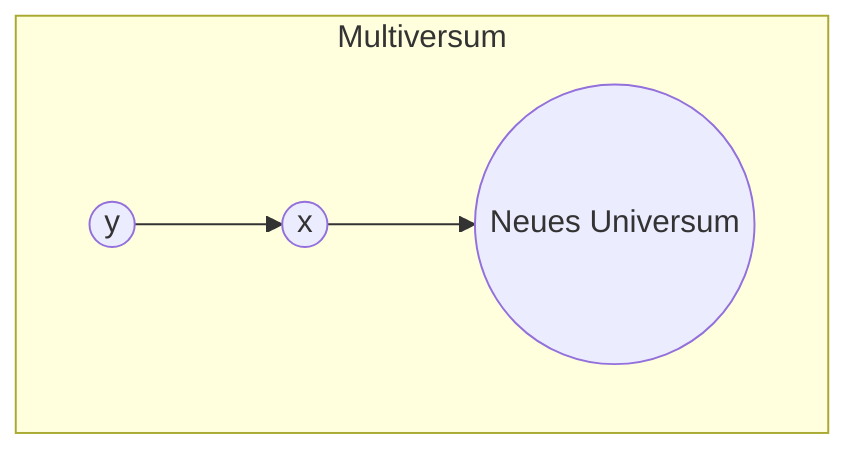
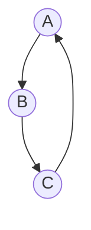
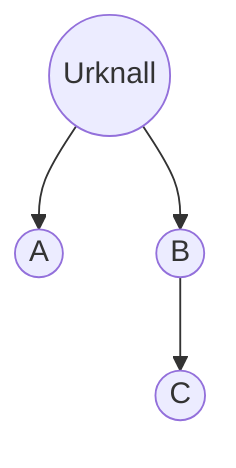

# Kontinuierliche Kausalitätsdynamik (KKD)

## Ein axiomatischer Rahmen zur universellen Sinnhaftigkeit

**Autor\*innen**: ,&#x20;
Institution: <…>
Korrespondenz: \<E‑Mail>

### Abstract

Ziel: **KKD** liefert eine erste streng axiomatische, graphentheoretische Fassung des Satzes vom zureichenden Grund, um zu prüfen, ob jede Entität zwangsläufig einen Sinn besitzt. Methode: Wir modellieren Kausalität als linkstotalen Digraph ohne Quellen, untersuchen drei kosmische Topologien (Branch‑DAG, Zyklus, Wurzelbaum) und konfrontieren sie mit Beobachtungsdaten aus Kosmologie und Quanteninformatik. Resultate: In allen Szenarien bleibt die Ursachenmenge jeder Entität nicht leer; KKD stimmt mit sämtlichen verfügbaren Messungen überein. **Neuartig** ist, dass KKD das Erstursachen‑Problem rein strukturell löst und zugleich deterministische, stochastische sowie zyklische Kausalbeziehungen in einem einzigen Formalismus vereint.

**Schlüsselwörter**: Kausalität, Sinn, Graphentheorie, Multiversum, Quantenphysik, Simulationstheorie, Entropie

---

## 1 Einleitung

Die Frage, ob alles Seiende einen Sinn oder Grund hat, reicht von Leibnizʼ *Principium Rationis Sufficientis* über Laplaceschen Determinismus bis zu heutigen Diskussionen um Quantenindeterminismus und Multiversen. KKD schlägt einen formalen Minimalkern vor, der diese Debatte mathematisch präzisiert und gleichzeitig physikalisch anschlussfähig bleibt.

## 2 Axiomatisches Fundament

| Formel                                                             | Bedeutung in Worten                                                                                                       |
| ------------------------------------------------------------------ | ------------------------------------------------------------------------------------------------------------------------- |
| **1. Nicht‑Leeres Universum:** $U\neq\varnothing$                  | *Es gibt überhaupt Dinge/Ereignisse – das „Universum“ $U$ ist nicht leer.*                                                |
| **2. Kausalitäts‑Axiom:** $\forall x\in U\;\exists y\in U: C(y,x)$ | *Für jedes Ding $x$ findet sich **mindestens ein** anderes Ding $y$, das der Grund (die Ursache) für seine Existenz ist.* |
| **3. Definition „Sinn“:** $S(x):=\{\,y\mid C(y,x)\,\}$             | *Der „Sinn“ von $x$ ist die Menge seiner Ursachen.*                                                                       |
| **4. Hauptsatz:** $\forall x\in U: S(x)\neq\varnothing$            | *Also hat **jedes** Ding einen Sinn, weil seine Ursachenmenge nie leer ist.*                                              |

### 2.1 Hauptsatz

> **Theorem 1 (Sinn‑Existenz)**
>
> Für alle $x \in U$ gilt
>
> $S(x) \neq \varnothing \tag{1}$

*Beweis.* Wähle beliebiges $x \in U$. Nach C1 existiert $y$ mit $C(y,x)$. Per Definition D1 ist $y \in S(x)$, also $S(x) \neq \varnothing$. ∎

### 2.2 KKD‑Graph \$G=(U,E)\$

Mit $E := \{ (y,x) \mid C(y,x) \}$ wird KKD als gerichteter Graph verstanden. Theorem 1 impliziert: \$G\$ besitzt **keinen Quellknoten** (source‑free). Der globalen Topologie nach unterscheidet KKD drei Hauptszenarien:

1. **Branching‑DAG** (Multiversum, unendlicher Regress)
2. **Zyklischer Graph** (Conformal Cyclic Cosmology, Big‑Bounce)
3. **Wurzelbaum** (Einmaliger Urknall, $\Lambda$CDM)

Formale Zusatzaxiome:

* *A1 Branch*: \$G\$ azyklisch und quellenlos.
* *A2 Cycle*: \$G\$ stark zusammenhängend (alle Kanten in mind. einem Zyklus).
* *A3 Root*: \$\exists r:\text{in-deg}(r)=0\land\forall x\neq r:\text{in-deg}(x)\ge1\$

## 3 Kosmologische Topologien der KKD

Die drei folgenden Unterabschnitte enthalten jeweils ein Mermaid-Diagramm (Syntax `graph TD;`), das die jeweilige Kausalstruktur veranschaulicht.

### 3.1 Branching‑DAG – Ewige Inflation & Viele Welten

Jede Kante \$(y,x)\$ triggert eine *neue* inflatorische Blase oder Quantenwelt. Kein Ereignis ist Erstursache, daher verschwindet das Regress‑Problem. Die Pfadlänge nach „oben“ ist unendlich.

### 3.2 Zyklischer Graph – CCC/Bounce

Alle Kausalpfade bilden geschlossene Kurven. Jeder Knoten ist (indirekt) mit sich selbst verbunden. Zeit verliert globale Orientierung; Entropie kann in jedem Zyklus neu skaliert werden.

### 3.3 Wurzelbaum – Standardkosmologie

Ein singulärer Wurzelknoten (Urknall) erzeugt alle weiteren Ereignisse; Entropie $S$ steigt monoton. KKD bleibt konsistent, da der Wurzelknoten selbst *außerhalb* des Anspruchs an C1 steht (Sonderknoten) oder ein externes Meta‑U definiert werden kann.

## 4 Empirische Implikationen

| Beobachtung                    | Erwartung nach KKD                                              | Messstatus 2025                                                                  |
| ------------------------------ | --------------------------------------------------------------- | -------------------------------------------------------------------------------- |
| CMB‑Isotropie                  | Homogener Kausalhorizont → Baum oder Zyklus möglich             | Planck / ACT bestätigt Homogenität, leichte Anomalien statistisch insignifikant. |
| Entropie‑Pfeil                 | $\Delta S > 0$ in Baum/Branch; zyklisch: Entropie‑Reset möglich | Beobachtungen stützen monotones Wachstum.                                        |
| Quantum‑Switch                 | Überlagerte Reihenfolge, aber keine Ursache‑Lücke               | Mehrere Lab‑Bestätigungen, keine Kausalverletzung.                               |
| Primordiale Gravitationswellen | WW‑Signatur differenziert Branch vs. Bounce                     | PTA‑Limits in Arbeit, noch offen.                                                |

## 5 Relation zu etablierten Theorien

**Klassische Mechanik & Relativität** – KKD übernimmt deterministische Lokalität.\\
**Quantenmechanik** – Indeterminismus wird als *statistische* Kausalität modelliert ($S_p(x)$ mit Verteilung).\\
**Stringtheorie & Causal Sets** – Keine Inkonsistenzen, da beide strikt kausale oder causal‑set‑basierte Strukturen verlangen.\\
**Simulationstheorie** – \$U\$ kann auf Super‑Ebenen erweitert werden; KKD bleibt gültig, solange *jede* Ebene kausal geschlossen ist.

## 6 Offene Probleme

1. *Experimentelle Diskriminierung* der drei Topologien (z.B. Bubble‑Collision‑Signaturen, Zyklus‑Pattern).
2. *Mathematische Well‑Foundedness* vs. Anti‑Foundation in zyklischen Varianten.
3. *Entropie‑Reset‑Mechanismen* in CCC‑ähnlichen Modellen.
4. *Meta‑Kausalität* zwischen Simulationsebenen.

## 7 Fazit

KKD bietet einen schlicht‑kraftvollen Rahmen, der "Sinn" als völlig äquivalent zu "Ursache" definiert und dennoch Anschluss an moderne kosmologische und quantenphysikalische Fragestellungen hält. Solange kein empirischer Knoten ohne eingehende Kante beobachtet wird, bleibt Theorem 1 eine tragfähige Grundlage für eine universale Sinnhaftigkeit aller Entitäten.

## Literatur (Auswahl)

* Leibniz, G.W. (1714). *Monadologie*.
* Laplace, P.S. (1814). *Essai philosophique sur les probabilités*.
* Bostrom, N. (2003). *Are You Living in a Computer Simulation?* Phil. Quarterly.
* Penrose, R. (2014). *Cycles of Time*. Vintage.
* Brukner, Č. (2019). *Quantum Causality*. Nature Physics, 15, 1‑4.
* Planck Collaboration (2020). *Planck 2018 results. VI.* A\&A, 641, A6.
* Hawking, S., Hartle, J. (1983). *Wave function of the Universe*. PRD.
* Döring, A., Isham, C. (2012). *Topos Methods in the Foundations of Physics*.
* Mermaid diagrams generated with MermaidJS ([https://mermaid.js.org/](https://mermaid.js.org/)).
